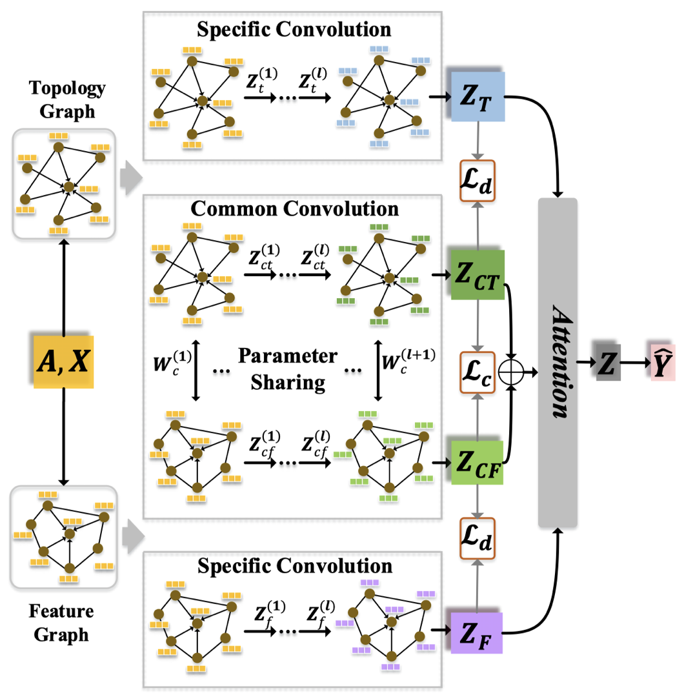
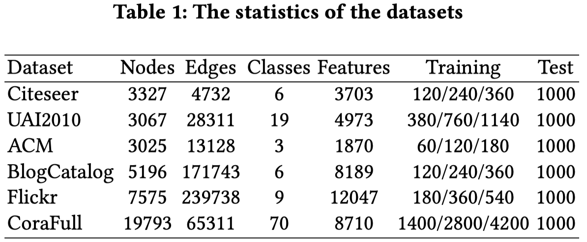
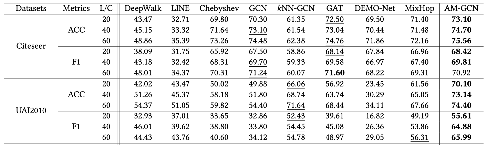
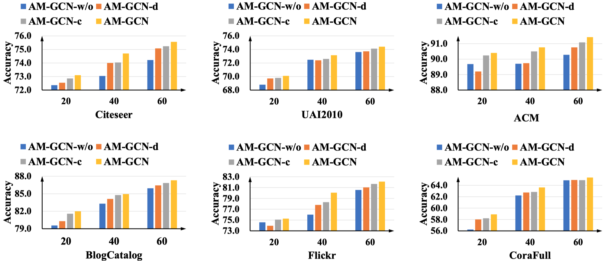
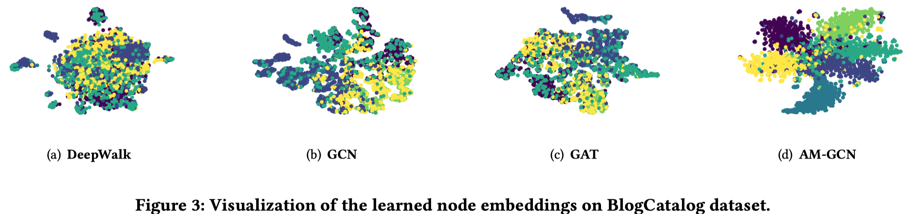
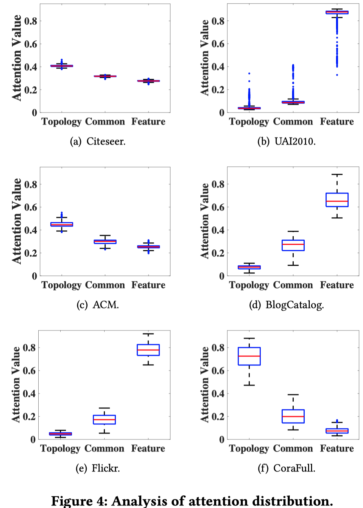

# AM-GCN: Adaptive Multi-channel Graph Convolutional Networks

2020-8 KDD 2020

AM-GCN主要针对的是节点分类任务，主要贡献包括两点：

1. 探究了之前的GCN方法是否能够较好的同时捕获topological structures和node features
2. 设计了 a novel adaptive multi-channel GCN framework, 能够适应的同时捕获两种不同的信息

<!--more-->

## 1 Introduction

之前的图卷积神经网络方法使用节点特征（node features）作为初始输入，然后进行图卷积操作。

作者提出的问题：

> What information do GCNs really learn and fuse from topological structures and node features?

一般的GNN中涉及到两种信息：

- 拓扑结构（主要指一个节点周围有哪些邻居节点）

- 节点信息（主要指节点本身的特征信息，比如论文节点的标题、关键字等文本信息）

这两个信息都可以用来进行图上的预测任务，但是哪个信息或者两个一起作用，对于最终的预测任务影响比较大？

AM-GCN主要针对的是节点分类任务，主要贡献包括两点：

1. 探究了之前的GCN方法是否能够较好的同时捕获topological structures和node features

2. 设计了 a novel adaptive multi-channel GCN framework, 能够适应的同时捕获两种不同的信息

## 2 FUSION CAPABILITY OF GCNS

探究GCN学习结构信息和节点特征信息的能力，设计了两个实验：

### Case 1: Random Topology and Correlated Node Features

实验设置：

- 900节点，3 class

- 0.3的概率随机生成边

- 对于3类节点，节点特征使用三个相同协方差，不同均值的高斯分布初始化

- GCN与基于节点特征的MLP对比

结果：GCN分类准确率75.2%，MLP准确率100%

### Case 2: Correlated Topology and Random Node Features

实验设置：

- 900节点，3 class

- 设计3 community，community内部建立边的概率是0.03， community内部建立边的概率是0.0015

- 随机生成节点特征

- GCN与Deepwalk（忽略节点特征）

结果：GCN分类准确率87%，MLP准确率100%

## 3 AM-GCN: THE PROPOSED MODEL

对于一个原始图的输入$G=(\mathbf{A},\mathbf{X})$，$\mathbf{A}$是邻接矩阵，$\mathbf{X}$是节点特征矩阵，构造两个图：

- Topology Graph：$\mathbf{A}_t=\mathbf{A}$，图原始的结构，与GCN一致
- Feature Graph：$\mathbf{A}_f$，该图中一个节点的相邻节点是k个特征相似的节点，不是原来的结构上的邻居节点

构造Feature Graph，首先计算一个节点与其它所有节点的相似度，计算一个余弦相似度矩阵$\mathbf{S}\in \mathbb{R}^{n\times n}$
$$
\mathbf{S}_{i,j}=\frac{\mathbf{x}_i\cdot \mathbf{x}_j}{|\mathbf{x}_i| |\mathbf{x}_j|}
$$
然后对于节点$i$，在$\mathbf{S}$中选择前$k$个相似度最大的节点作为feature node，得到$\mathbf{A}_f$。

AM-GCN的整体模型图：

可以看到其中有三个主要核心模块，包括在Topology Graph和Feature Graph上的卷积，以及捕获两者共有特征的卷积。

### 3.1 Specific Convolution Module

在Topology  Graph上的卷积：
$$
\mathbf{Z}_t^{(l)} = ReLU(\tilde{D}^{-\frac{1}{2}}_t \tilde{A}_t \tilde{D}^{-\frac{1}{2}}_t \mathbf{Z}_t^{(l-1)} \mathbf{W}_t^{(l)} )
$$
其中，$\tilde{A}_t=A_t+I_t$，该卷积方法与GCN一模一样

在Feature Graph上的卷积：
$$
\mathbf{Z}_f^{(l)} = ReLU(\tilde{D}^{-\frac{1}{2}}_f \tilde{A}_f \tilde{D}^{-\frac{1}{2}}_f \mathbf{Z}_f^{(l-1)} \mathbf{W}_f^{(l)} )
$$
其中，$\tilde{A}_f=A_f+I_f$

### 3.2 Common Convolution Module

实际上，feature space和topology space不是完全独立的，两者的信息可能互补然后一起可以用于预测任务。因此，AM-GCN设计了一个common module使用parameter sharing strategy捕获两者的通用特征。

在topology space中导出embedding：
$$
\mathbf{Z}_{ct}^{(l)} = ReLU(\tilde{D}^{-\frac{1}{2}}_t \tilde{A}_t \tilde{D}^{-\frac{1}{2}}_t \mathbf{Z}_{ct}^{(l-1)} \mathbf{W}_c^{(l)} )
$$
在feature space中导出embedding：
$$
\mathbf{Z}_{cf}^{(l)} = ReLU(\tilde{D}^{-\frac{1}{2}}_f \tilde{A}_f \tilde{D}^{-\frac{1}{2}}_f \mathbf{Z}_{cf}^{(l-1)} \mathbf{W}_c^{(l)} )
$$
最后，两个结合得到common embedding：
$$
\mathbf{Z}_{c} = (\mathbf{Z}_{ct} + \mathbf{Z}_{cf})/2
$$

### 3.3 Two Constraints

Consistency Constraint:

用来控制两个common embedding的consistency，首先将$\mathbf{Z}_{ct}$和$\mathbf{Z}_{cf}$使用$l_2$正则归一化，然后得到下面节点之间的相似度
$$
\mathbf{S}_T=\mathbf{Z}_{CTnor}\cdot \mathbf{Z}_{CTnor}^T \\
\mathbf{S}_F=\mathbf{Z}_{CFnor}\cdot \mathbf{Z}_{CFnor}^T
$$
之后约束：
$$
\mathcal{L}_c=|| \mathbf{S}_T - \mathbf{S}_F ||^2
$$
Disparity Constraint:

因为$\mathbf{Z}_{ct}^{(l)}$和$\mathbf{Z}_{t}^{(l)}$都是从topology space中学习得到的，为了保证它们都是反映了不同的信息，因此使用Hilbert-Schmidt Independence Criterion (HSIC)加强它们的disparity。
$$
HSIC(\mathbf{\mathbf{Z}_{T}},\ \mathbf{\mathbf{Z}_{CT}}) = (n-1)^{-2}tr(\mathbf{R} \mathbf{K}_T \mathbf{R} \mathbf{K}_{CT})
$$
同样的，对于$\mathbf{\mathbf{Z}_{F}},\ \mathbf{\mathbf{Z}_{CF}}$：
$$
HSIC(\mathbf{\mathbf{Z}_{F}},\ \mathbf{\mathbf{Z}_{CF}}) = (n-1)^{-2}tr(\mathbf{R} \mathbf{K}_F \mathbf{R} \mathbf{K}_{CF})
$$
最终，
$$
\mathcal{L}_d =HSIC(\mathbf{\mathbf{Z}_{T}},\ \mathbf{\mathbf{Z}_{CT}}) +HSIC(\mathbf{\mathbf{Z}_{F}},\ \mathbf{\mathbf{Z}_{CF}})
$$

### 3.4 Attention Mechanism

$$
(\alpha_t, \alpha_c, \alpha_f)=att(\mathbf{Z}_T, \mathbf{Z}_C, \mathbf{Z}_F) 
$$

以计算$\alpha_t$为例：
$$
\omega_T = \mathbf{q}^T \cdot tanh(\mathbf{W} \mathbf{z}_T + \mathbf{b}) \\
\alpha_T = softmax(\omega_T)
$$
最终AM-GCN得到的节点embedding为：
$$
\mathbf{Z} = \mathbf{\alpha}_T \cdot \mathbf{Z}_T + \mathbf{\alpha}_C \cdot \mathbf{Z}_C + \mathbf{\alpha}_F \cdot \mathbf{Z}_F
$$

## 4 EXPERIMENTS

### 4.1 Node Classification

在7个数据集上进行评估，数据集主要是论文的引文网络和社交网络

注意其中的每个数据集训练集有三个级别，分别对应每一类的节点有标签的比例为20%， 40%和60%，测试集恒定每一类由1000个节点评估。

其中，kNN-GCN是AM-GCN只在feature graph上进行聚合。

对比GCN和kNN-GCN一个比较有意思的结果是不聚合邻居，有时候根据特征聚合相似的节点，也可能取得更好的结果。

### 4.2 Analysis of Variants

比较设计的约束的作用：

- AM-GCN-w/o: AM-GCN without constraints $L_c$ and $L_d$

- AM-GCN-c: AM-GCN with the consistency constraint $L_c$

- AM-GCN-d: AM-GCN with the disparity constraint $L_d$

可以看出来，一般情况下，consistency constraint比disparity constraint更加重要

### 4.3 Visualization

### 4.4 Analysis of Attention Mechanism

分析不同数据集下，三个不同embedding的注意力值的分布

可以看到，不同数据集下，三个不同方面的embedding对应的注意力值不同，说明哪个方面包含了更加丰富的信息是依赖于具体数据的。