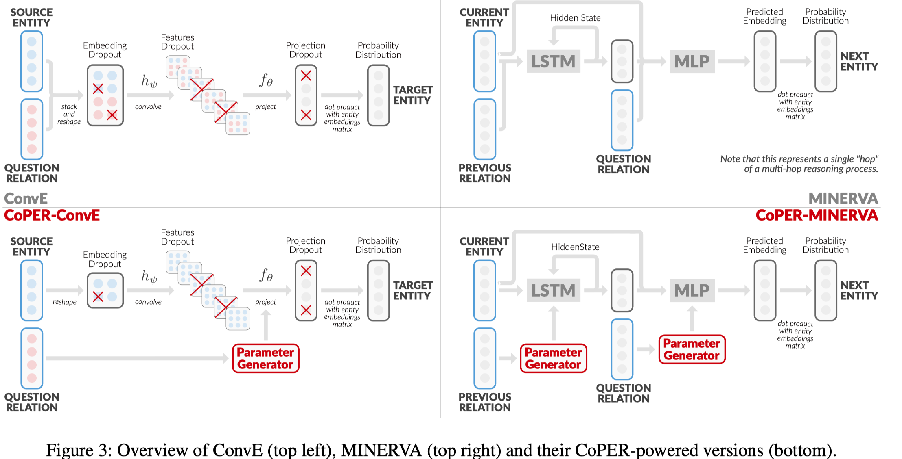
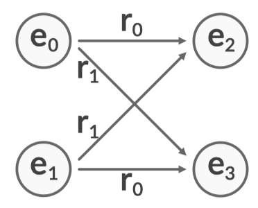
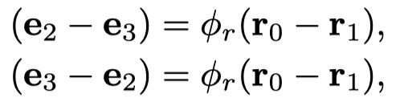
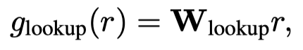
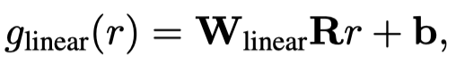
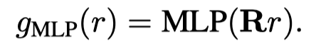

# CoPER

认为之前的KGE方法将entity embedding和relation embedding之间的交互都局限在additive上。
这篇文章使用relation embedding产生参数，转化entity embedding。

<!--more-->

首先它指出了之前很多方法对于entity embedding和relation embedding的学习是受限的，比如$w[h;r]$，这样的方式，无法建模下面的例子。

属于additive的方式，无法很好的区分$e_0$，$e_1$，$e_2$，$e_3$

在实现的方法中，它设计了三个不同的产生参数的module，contextual parameter generator (CPG).

Parameter Lookup Table：

Linear Projection.：

Multi-Layer Perceptron. ：

实验中发现，第一种方法效果s都不太好，容易过拟合，而且relation之间没有information sharing。第二中方法和第三种方法更合适，第二中方法适合于更大size的dataset，第三种更适合小一点的dataset。
在ConvE和MINERVA方法的基础上加入了CPG模块，具体看图

需要注意的一点是它使用了新的训练方式，导致ConvE和DISTMULT这些方法的效果远远好于原来的效果，以后可以详细看一下。
优点：和ParamE类似，都是将relation embedding转换到了parameter space中，但是ParamE是完全将模型参数都作为relation embedding，而CoPER是使用某种结构转换relation embedding到参数中，还需要选择在什么地方使用由relation embedding转换过来的parameter。
可以利用或改进的点：可以利用这样的思想，将relation embedding转换为参数，然后和entity embedding进行交互。

