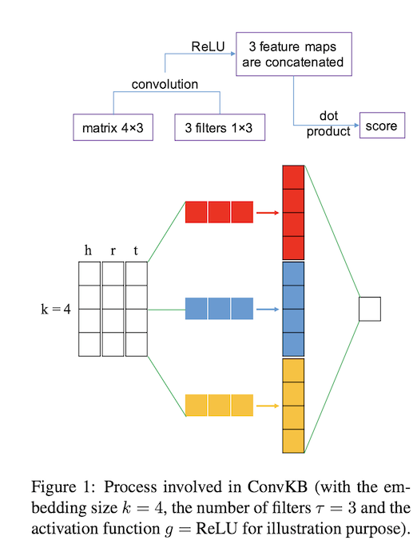

# A Novel Embedding Model for Knowledge Base Completion Based on Convolutional Neural Network

2018-3-13 ConvKB

<!--more-->

## 1 Introduction

知识图谱可以为knowledge base/knowledge graph

知识图谱在很多领域都有重要的作用，但是在open world assumion下，知识图谱本身是不完整的，不能包含所有实际存在的三元组。

在这种情况下，预测(h,r,t)是否valid就有意义了，这就是link prediction或者叫做knowledge completion。

之前有人提出过ConvE（2018），首个将CNN应用到knowledge completion中的model。

ConvKB就是在其基础上发展起来的。

CNN的意义：

> CNN learns non-linear features to capture complex relationships with a remarkably less number of parameters compared to fully connected neural networks.

总结一下CNN相比fully connected neural network优势：

- 更少的参数
- 能够捕获复杂的，非线性的关系

## 2 Proposed ConvKB model

首先三元组组成矩阵
$$
A=[v_h,v_r,v_t]\in R^{k\times 3}
$$
之后经过一个简单的CNN层，
$$
v_i=g(w\cdot A_{i;}+b) \\
w\in R^{1\times k}
$$
一个filter $w$得到一个$k\times 1$维的feature map

共有$\Gamma$个filter，通过concat得到$R^{\Gamma k\times 1}$维的向量，

最后与一个权值矩阵$W\in R^{\Gamma k\times 1}$相乘，得到最终的结果score。score function衡量不相似的程度，越小越相似。

训练时候的损失函数是log-likehood损失函数。

## 3 Experiments

实验数据集：

- WN18RR
- FB15k237

都是对于WN18和FB15k去除可逆关系之后的结果

sample corrupt triplets的时候采用了Bernoulli trick

embedding初始化使用TransE训练出来的结果

filter情况下的数据集进行训练