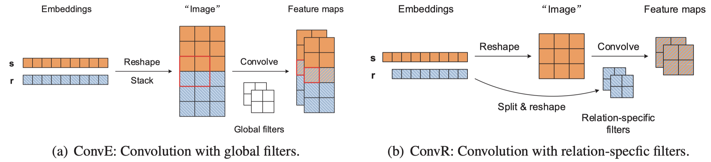
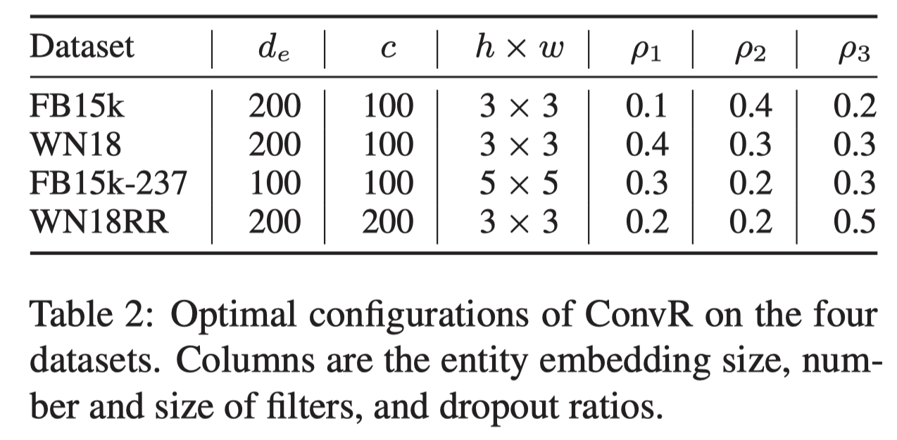

# Adaptive Convolution for Multi-Relational Learning

2019-6

## 1 Introduction

> Learning with multi-relational data plays a pivotal role in many application domains, ranging from social networks or recommender systems to large-scale knowledge bases (KBs)

ConvR的思想是从relation中构造filter，然后卷积于subject embedding，最后投影，与object embedding做点积。

这样的做法就导致了ConvR的另一个优势，减少了参数的数量。

<!--more-->

## 3 Adaptive Convolution on Multi-relational Data

对于三元组$(s, r, o)$，首先将$e_s$ reshape为2D矩阵，
$$
e_s\in R^{d_e}\Rightarrow S\in R^{d_e^h,\ d_e^w}
$$
对于关系$r$，先分割为$c$段：
$$
r^{(1)},\cdots,r^{(c)}
$$
然后每个$r^{(l)}$ reshape为2D的矩阵作为filter
$$
R^{l}\in R^{h,\ w}
$$
对于$c$个filter，在$S$上卷积，得到$c$个feature map。

将$c$个feature map先展开为一维，然后stack到一起，得到单向量$e_c$。

最后过一个全连接层，和尾结点计算点积
$$
\psi(s,r,o)=f(We_c+b)e_o
$$
训练方式与ConvE保持一致。

比起ConvE的好处就是结果更好，参数更少，空间复杂度降低。

ConvR使用三个dropout防过拟合：

- 在reshape subject representation时
- 在卷积得到feature map之后
- 在经过全连接之后

## 4 Experiments

使用了四个数据集：

- FB15k
- WN18
- FB15K-237
- WN18RR

实现的超参：

