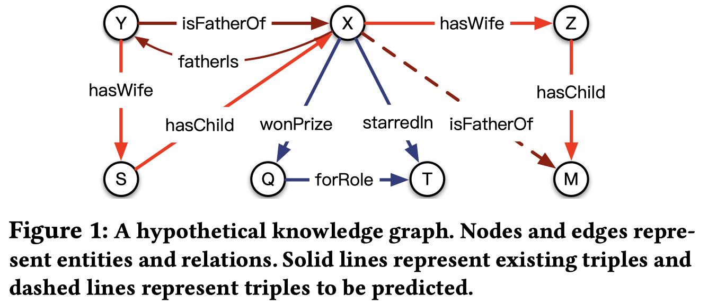
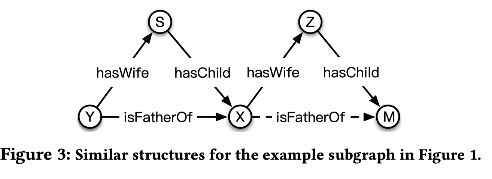
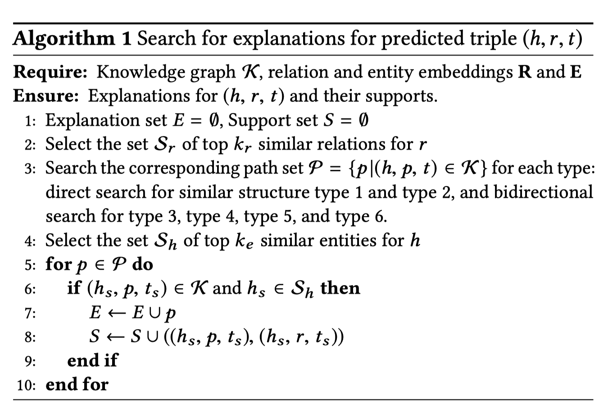

# Interaction Embeddings for Prediction and Explanation in Knowledge Graphs

2019-3-12日发表

设计了一种有效的，浅层的KGE方法CrossE，能够让entity embedding和relation embedding进行更多的交互。

<!--more-->

## Abstract

在知识图谱embedding的现有技术当中，Crossover interactions信息没有被利用过，本文提出的CrossE就是利用这种信息，并且进行了link prediction和prediction explanation的实验。

## 1. INTRODUCTION

几个出名的知识图谱Yago，WordNet，Freebase都是以$(h, r, t)$表示的三元组。

> Knowledge graph embedding (KGE) learns distributed representations [11] for entities and relations, called entity embeddings and relation embeddings.

三种知识图谱embedding类型，

- tensor factorization based RESCAL , 
- translation-based TransE , 
- neural tensor network NTN 

但是这些模型都没有使用过Crossover interactions。

Crossover interactions包括interaction from relations to entities和interactions from entities to relations.

例如在上图中预测(X, isFatherOf, ? )

那么，与关系isFatherOf有关的实体只有Y，S这些与X是家庭关系的实体，与Q，T实体无关，这就叫做interaction from relations to entities，根据关系选择实体

同时，关系isFatherOf有两条途径，但头结点实体是X，所以只能选择X作为头结点的关系，这叫做interactions from entities to relations.

因此提出了CrossE：

1. generate interaction embeddings $h_I$ for head entity $h$
2. generate interaction embeddings $r_I$ for relation $r$
3. combine interaction embeddings $h_I$ and $r_I$ together
4. compare the similarity of combined embedding with tail entity embedding$t$

## 2. Related work

不考虑利用了额外信息进行embedding的模型，剩下的模型从entity是否表示为统一的形式划分，

- KGEs with general embeddings：

  > Existing embedding methods with general embeddings all represent entities as low-dimensional vectors and relations as operations that combine the representation of head entity and tail entity.

  典型模型包括：TransE, RESCAL，DistMult，ComplEx

  这些模型都没有考虑在不同情况下embedding应该是不同的，没有考虑crossover interaction

- KGEs with multiple embeddings：

  > Some KGEs learn multiple embeddings for entities or relations under various considerations.

  比如：Structured Embedding (SE)（每个关系有两个矩阵），ORC（每个entity有head embedding和tail embedding），TransH，TransR等

  这些模型，relation的embedding是general的，只考虑了relation->entity的interaction

## 3. CrossE: MODEL DESCRIPTION

CrossE最大的创新就在于考虑了新的embedding内容，同时没有增加过多的参数。

初始定义：

- $E \in R^{n_e \times d}, R \in R^{n_r \times d}, C \in R^{n_r \times d}$分别表示所有实体，关系和interaction matrix
- $x_h, x_r, x_t$分别表示(h, r, t)的one-hot形式

对于一个三元组(h, r, t)进行预测的顺序如下：

### 3.1 获取general embedding

$$
h=x_h^T E,\ r=x_r^T R,\ t=x_t^T E
$$

### 3.2 Interaction Embedding for Entities.

对于头结点h，
$$
h_I = c_r \circ h \\
c_r = x_r^TC
$$
其中的$\circ$是Hadamard product, an element-wise operator

### 3.3 Interaction Embedding for Relations

对于关系r，模型来自头结点的信息，
$$
r_I = h_I \circ r
$$

### 3.4 Combination Operator

将前面的两个基于interaction的embedding联合起来，
$$
q_{hr}=tanh(h_I+r_I+b)
$$

### 3.5 Similarity Operator

计算最终的相似度，
$$
f(h, r, t)=\sigma(q_{hr}t^T)=\sigma(tanh(c_r\circ h+c_r\circ h \circ r+b )t^T)
$$
最终的loss function使用交叉熵。

## 4 EXPLANATIONS FOR PREDICTIONS

在知识图谱的explanation：

- 在知识图谱中对于(h, r, t)可以成立的explanation是指从h->t的路径

- 对于一个explanation，应该有对应的一个或多个support，在这篇论文当中，explanation的support就是现存的知识图谱中相似结构，如下图所示。

  

寻找explanation的步骤：

详细的请参考论文

## 5 EXPERIMENTAL EVALUATION

略