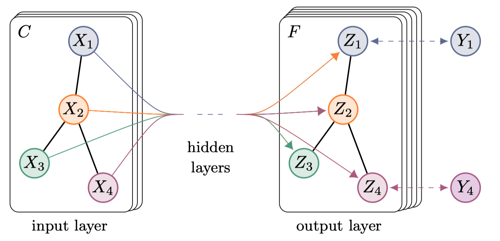
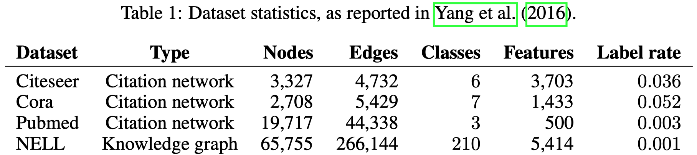
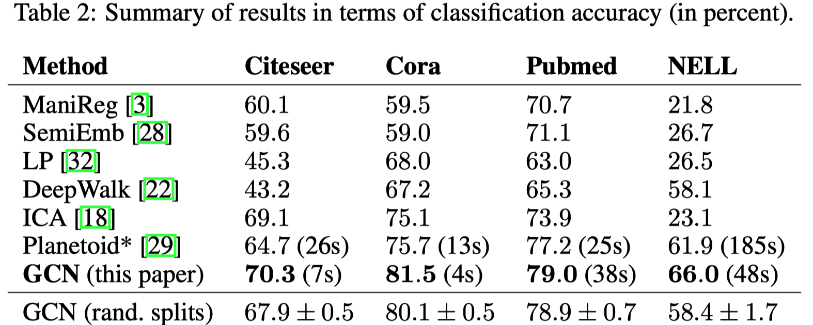
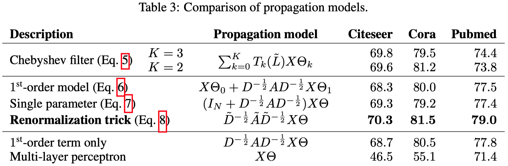
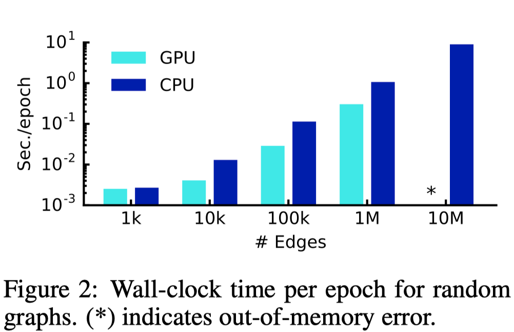

# SEMI-SUPERVISED CLASSIFICATION WITH G RAPH CONVOLUTIONAL NETWORKS

ICLR 2017

贡献：提出了一种模拟卷积神经网络的变种，直接在图结构上进行类似的卷积操作的神经网络。通过对谱卷积神经网络（Spectral GNN）进行一阶估计简化（first-order approximation），提出了一阶图卷积神经网络——GCN。

<!--more-->

## 1 Introduction

为了能够利用图结构进行学习，首先我们需要采取某种方式表示图。一个图的常用表达形式是$G=(V,E)$，$V$是节点（vertices）的集合，$E$是边（edge）的集合。如果存在边$e=u,v$，那么$u$可以被称作$v$的邻居，可以说节点$u$和$v$是邻接的（adjacent）。

图有几种不同的代数表达形式：

- 邻接矩阵（Adjacency matrix）：对于一个简单图$G=(V,E)$，邻接矩阵$A\in \mathcal{R}^{n\times n}$定义为：

$$
A_{ij} =
\begin{cases}
1,  & \mbox{if }\{ v_i, v_j \}\in E \mbox{ and } i \not= j \\
0, & \mbox{if }\mbox{ otherwise}
\end{cases}
$$

- 度矩阵（Degree matrix）：度矩阵$D\in \mathcal{R}^{n\times n}$是一个对角矩阵s：

$$
D_{ii}=d(v_i)
$$

- 拉普拉斯矩阵（Laplacian matrix）：拉普拉斯矩阵定义为度矩阵减去邻接矩阵，$L=D-A$：

$$
L_{ij} =
\begin{cases}
d(v_i),  & \mbox{if } i = j \\
-1, & \mbox{if }\{ v_i, v_j \}\in E \mbox{ and } i\not=j \\
0, & \mbox{otherwise}
\end{cases}
$$

- 对称归一化拉普拉斯矩阵（Symmetric normalized Laplacian）：将上面的拉普拉斯矩阵归一化：
  $$
  \begin{align}
  L^{sym}&=D^{-\frac{1}{2}}LD^{-\frac{1}{2}} \\
  &=I-D^{-\frac{1}{2}}AD^{-\frac{1}{2}}
  \end{align}
  $$
  最终得到了归一化拉普拉斯矩阵，矩阵中的元素定义为：
  $$
  L_{ij}^{sym} =
  \begin{cases}
  1,  & \mbox{if } i = j \mbox{ and } d(v_i)\not=0 \\
  -\frac{1}{\sqrt{d(v_i)d(v_j)}}, & \mbox{if }\{ v_i, v_j \}\in E \mbox{ and } i\not=j \\
  0, & \mbox{otherwise}
  \end{cases}
  $$

接下来我们讨论的图是无向图，那么拉普拉斯矩阵是对称矩阵，归一化之后的图拉普拉斯矩阵是半正定对称矩阵。

基于归一化拉普拉斯矩阵，我们可以将它对角化，$L^{sym}=U\Lambda U^T$，其中$U=[\mathbf{u}_0,\mathbf{u}_1, \dots,\mathbf{u}_n]\in \mathcal{R}^{n\times n}$是特征向量矩阵，$\Lambda_{ii}=\lambda_i$是特征值。这一对角化实对称矩阵的操作在线性代数中叫做谱分解，$\Lambda$称作谱（spectrum）。实对称矩阵的特征向量一定是正交的（orthogonal），特征值一定是实数。特征向量构成了谱空间的基。在图的信号处理中，一个图信号（graph signal）定义为$x\in \mathcal{R}^n$，每个节点都有一个对应的数值，这一图信号也叫做节点的特征，可以拥有多个特征，那么把多个图信号按列排序就得到了一个图的特征矩阵：
$$
X\in \mathcal{R}^{n\times D}
$$
$X_i$表示第$i$个节点的特征，$X_{ij}$表示第$i$个节点的第$j$个特征。

在介绍GCN之前，需要介绍首个定义在图上进行的卷积操作原理。

在图信号处理中，模仿一般的傅里叶变换定义了图傅里叶变换（graph Fourier transform），就是将处于原来特征空间下的图信号投影转换到谱空间中，
$$
\mathcal{F}(x)=U^Tx
$$
傅里叶逆变换定义为：
$$
\mathcal{F}^{-1}(x)=U\hat{x}
$$
由于图不满足平移不变性，我们希望直接在特征空间下定义图的卷积算子$f*g$比较困难，$x$是输入的图信号（signal），$g$是过滤器（filter）。但利用卷积定理，信号卷积的傅里叶变换等价于信号傅里叶变换的乘积。
$$
\mathcal{F}({x*g})=\mathcal{F}(x)\cdot \mathcal{F}(g)
$$
那么图卷积算子可以定义为：
$$
{x*g}=\mathcal{F}^{-1}(\mathcal{F}(x)\cdot \mathcal{F}(g))
$$
这样我们无需考虑原特征空间中的卷积，只需要先将信号转换为谱空间中的信号，在谱空间中与谱空间中的过滤器做乘法，最后利用傅里叶逆变换转换到原来的空间中，就实现了图卷积。

更具体的图卷积算子定义为：
$$
\begin{align}
{x*g}&=\mathcal{F}^{-1}(\mathcal{F}(x)\cdot \mathcal{F}(g)) \\
&=U(U^Tx\cdot U^Tg) \\
\end{align}
$$
其中，$U^Tg$是一个向量，可以看做是对角矩阵$g_{\theta}=diag(U^Tg)$，最后谱卷积算子定义为：
$$
{x*g}=Ug_{\theta}U^Tx
$$
所有基于谱空间的图卷积方法都是在尝试寻找更合适的$g_{\theta}$。

## 2 FAST APPROXIMATE CONVOLUTIONS ON GRAPHS

Spectral CNN（Spectral Convolutional Neural Network）直接将$g_{\theta}$作为一系列可以学习的参数，得到了下面的卷积公式：
$$
H^{(l+1)}_{:,j}=\sigma(\sum_{i=1}^{f_{l}} U\Theta^{l}_{i,j}H^{(l)}_{:,i}) \ (j=1,2,3\dots,f_l)
$$
这里任然需要计算特征向量，计算代价很大。

之后切比雪夫网络（Chebyshev Spectral CNN，ChebNet）对Spectral CNN进行简化，使用切比雪夫多项式简化$g_{\theta}$，令$g_{\theta}=\sum_{i=0}^K\theta_i T_i(\tilde{\Lambda})$，其中$\tilde{\Lambda}=2\Lambda/\lambda_{max}-I_n$得到了下面的卷积公式：
$$
\begin{align}
{x*g} &\approx U\sum_{i=0}^K \theta_i T_i(\tilde{\Lambda}) U^T x \\
&= \sum_{i=0}^K \theta_i T_i(\tilde{L}) x
\end{align}
$$
其中，$\tilde{L}=2L/\lambda_{max}-I_n$。这样ChebNet不需要再计算特性向量$U^T$。

GCN在ChebNet的基础上，进一步将K阶多项式限制到了1阶，假设$\lambda_{max}=2$得到了新的卷积算子：
$$
{x*g} \approx \sum_{i=0}^K \theta_i T_i(\tilde{L}) \approx \theta_0x + \theta_1x(L-I_n)x=\theta_0x + \theta_1 D^{-\frac{1}{2}}AD^{-\frac{1}{2}} x
$$
由于半监督图节点分类学习的数据量少，令0阶系数和1阶系数相同，减小学习的参数量。
$$
\begin{align}
{x*g} &\approx \theta_0x + \theta_1 D^{-\frac{1}{2}}AD^{-\frac{1}{2}} x \\
&\approx \theta (I_n + D^{-\frac{1}{2}}AD^{-\frac{1}{2}})x
\end{align}
$$
最终提出了具有多层结构的图卷积神经网络（GCN），每一层使用的卷积函数定义如下：
$$
H^{(l+1)}=\sigma (\tilde{D}^{-\frac{1}{2}}\tilde{A}\tilde{D}^{-\frac{1}{2}}H^{(l)}W^{(l)})
$$
其中$\tilde{D}$和$\tilde{A}$是区别于之前的度矩阵和邻接矩阵，
$$
\tilde{A}=A+I_N\\
\tilde{D}_{ii}=\sum_j{\tilde{A}_{ij}}
$$
原因是在实验中发现，如果使用原来的形式会导致训练的不稳定性以及梯度消失/爆炸的问题，因此重新归一化。

GCN用来做半监督的节点分类任务，在实现的时候使用了两层GCN，最后经过Softmax输出预测值。损失函数使用交叉熵。

## 3 EXPERIMENTS

使用以下四方面的实验：

- semi-supervised document classification in citation networks
- semi-supervised entity classification in a bipartite graph extracted from a knowledge graph
- an evaluation of various graph propagation models
- a run-time analysis on random graphs

使用的数据集：

需要注意的一点是对于知识图谱这种有向图，GCN将关系拆出来作为一个联通两个节点的新节点，这样知识图谱就转换为了无向图。

### 3.1 SEMI-SUPERVISED NODE CLASSIFICATION

### 3.2 EVALUATION OF PROPAGATION MODEL

对于GCN机制的一个探究。

### 3.3 TRAINING TIMEPER EPOCH

## 4 DISCUSSION

切比雪夫网络是利用切比雪夫多项式对Spectra CNN进行的简化估计，无需再计算特征向量$U$；GCN是对切比雪夫网络进一步的简化，将K阶多项式限制到了1阶，同时令0阶系数和1阶系数相同，得到了更简洁的图卷积形式。

优点：

- 直接将图卷积算子简化到了一步线性计算的程度
- 形式上来看已经和一般的神经网络非常相似了，方便与已有的深度学习方法进行结合

缺点：

- 内存的限制，需要训练全图
- 无法学习有向图以及边的特征s