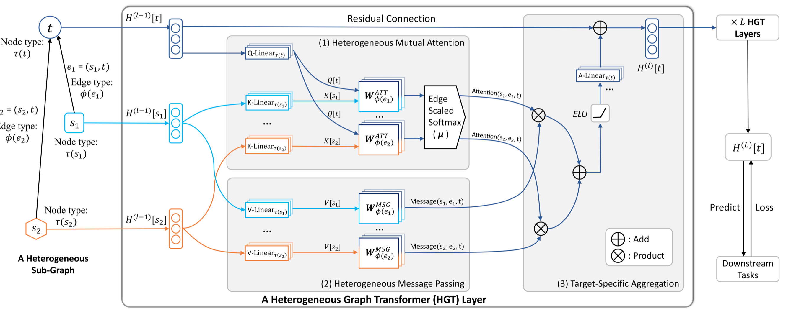
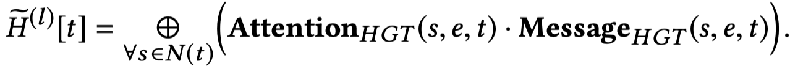
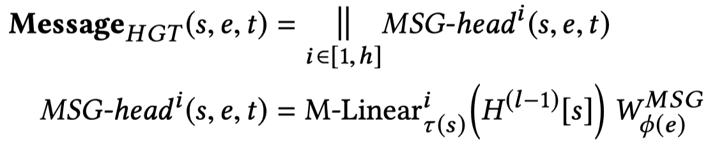
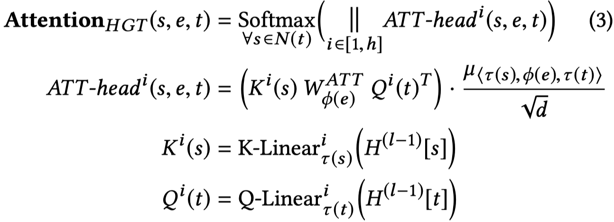
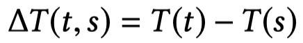
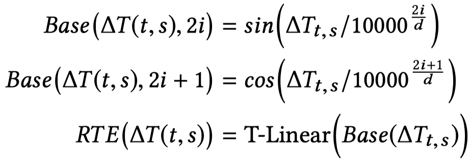
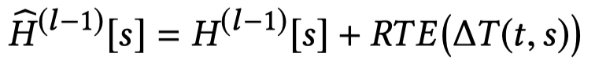
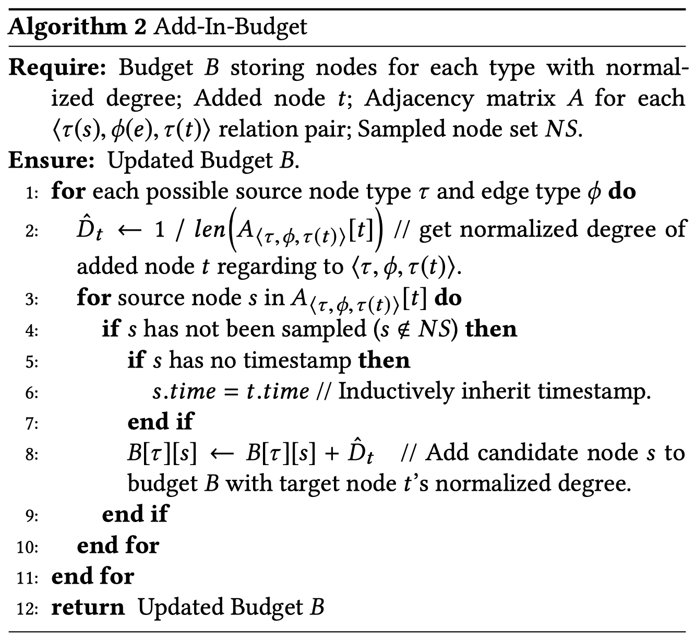
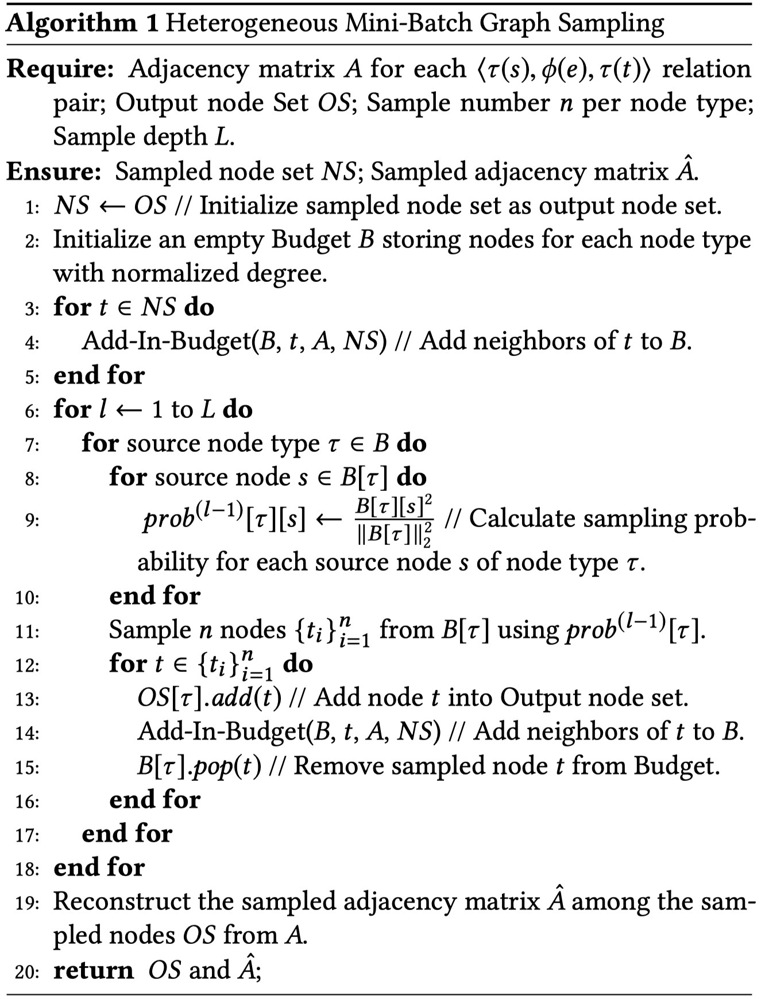

# Heterogeneous Graph Transformer

本文的贡献主要有三点：

1. 针对异质图设计了Heterogeneous Graph Transformer，HGT，用于处理Web-scale的异质网络。
2. 为了能够训练大规模图，提出了HGSampling采样方法，在Open Academic Graph (OAG)上进行了验证。
3. 针对动态异质图，引入relative temporal encoding，能够处理任意的动态信息

<!--more-->

WWW 2020 

## Introduction

**Motivation** ：对于heterogeneous graph已有的处理方法有基于meta-path的方法，以及最近出现的GNN方法。但是这些方法都面临问题。

1. 大多数的方法为不同的heterogeneous graph设计meta path，要求specific domain knowledge
2. 很多方法要么忽略不同type的差异，直接使用共通的weight，要么直接认为不同type之间是完全独立的，为不同的方法定义各自独立的weight
3. 它们大多数忽略了heterogeneous graph中存在的动态特性dynamic nature
4. 它们intrinsic design无法modeling Web-scale heterogeneous graph

> First, most of them involve the design of meta paths for each type of heterogeneous graphs, requiring specific domain knowledge; 
>
> Second, they either simply assume that different types of nodes/edges share the same feature and representation space or keep distinct non-sharing weights for either node type or edge type alone, making them insufficient to capture heterogeneous graphs’ properties; 
>
> Third, most of them ignore the dynamic nature of every (heterogeneous) graph; 
>
> Finally, their intrinsic design and implementation make them incapable of modeling Web-scale heterogeneous graphs.

**Method**：作者提出了HGT期望能够解决上面的四个问题。

1. To handle graph heterogeneity，引入node- and edge-type dependent attention mechanism. 在计算边$<s, t>$的attention时，使用meta relation $⟨node\ type\ of\ s,\ edge\ type\ of\ e\ between\ s\ \&\ t,\ node\ type\ of\ t⟩$。给不同的type定义不同的weight matrix，然后组合起来成为这条边的weight matrix。这样子的话不同type的weight matrix就可以互相交互，互相影响。weight matrix被用来计算attention。另外，由于GNN的天性，聚合多阶邻居实际就是在被认为学习“soft” meta paths。另外根据attention，又能够更好的区分学习到的这些soft meta path。
2. To handle graph dynamics，类似于Transformer position encoding，定义了relative temporal encoding (RTE)。不是把不同timestamp的graph看做不同的图，而是直接把带有不同RTE的node一起聚合。
3. To handle Web-scale graph data，提出了HGSampling，采样的subgraph具有和global graph相似的node type分布，同时还保证the sampled sub-graphs dense for minimizing the loss of information。

先来看几个定义：

Heterogeneous Graph（a.k.a. heterogeneous information networks）

> Definition 1. Heterogeneous Graph: A heterogeneous graph is defined as a directed graph G = (V, E, A, R) where each node v ∈ V and each edge e ∈ E are associated with their type mapping functions τ(v) : V → A and ϕ(e) : E → R, respectively.

“异质”的本质就是来源各不相同，type不同。

Meta Relation

> For an edge $e = (s,t)$ linked from source node s to target node t, its meta relation is denoted as $⟨\tau (s),\phi (e),\tau (t)⟩$。

常用的meta path可以看做是一系列这样的meta relation的组合

Dynamic Heterogeneous Graph.

> To model the dynamic nature of real-world (heterogeneous) graphs, we assign an edge $e = (s,t)$ a timestamp $T$, when node $s$ connects to node $t$ at $T$.

当一个node $s$在时间$T$链接到$t$的时候，认为这条边的timestamp就是$T$，并且在以后不再更改。

## Method

整体结构：

注意这里，A-Linear是根据node $t$的type决定的。同时使用了残差结构。

聚合函数就是直接相加。

核心是两部分，产生消息，然后产生注意力。

产生消息：

邻居node的type和邻居relation的type的weight相乘。

产生attention：

这里在计算attention的时候就使用了meta relation。矩阵相乘的操作表示着parameter sharing。

除去vanilla Transformer中已经使用的K-Q计算注意力，值得注意的是加入了一个$\mu \in \mathbb{R}^{|\mathcal{A}|\times |\mathcal{R}|\times |\mathcal{A}|}$。为所有的meta relation组合定义了一个全局范围的权重。这样导致的后果是除去单纯局部的attention，加入了global attention，能够更adaptively的学习attention。

## RTE

前面提到了RTE，它的核心思想是为不同timestamp的edge学习不同的表示，然后加到邻居node $s$的表表示$H[s]$上。

首先计算时间差，

，然后编码，使用一个scalar生成一个embedding

$2i,\ 2i+1$应该是dim

最后加到邻居node $s$的表表示$H[s]$上。

## HGSampling

为了训练大规模的graph，必须进行采样，每次只训练一部分的graph，即采样subgraph。这一操作在graphSAGE中已经有相应的算法。但是问题在于，这样随机的采样导致后果是sub-graph在不同type下采样的数量非常imbalance。

> To address this issue, different sampling-based methods [1, 2, 7, 29] have been proposed to train GNNs on a subset of nodes. However, directly using them for heterogeneous graphs is prone to get sub-graphs that are extremely imbalanced regarding different node types, due to that the degree distribution and the total number of nodes for each type can vary dramatically.

HGSampling算法能够保证两点：

1. 不同类型的node和edge具有相近的数量
2. 每次采样得到的sub-graph足够密集能够用于降低loss，同时减少sample variance

核心思想是为不同的node type，根据重要程度，采样相同数量的node。

## Experiment

核心数据集，Open Academic Graph (OAG)

> OAG consists of more than 178 million nodes and 2.236 billion edges—the largest publicly available heterogeneous academic dataset. In addition, all papers in OAG are associated with their publication dates, spanning from 1900 to 2019.

为了验证模型的泛化性，同时从OAG中抽离出来两个不同的子集，Computer Science (CS) and Medicine (Med) academic graphs。

对于所有的edge，增加self和reverse relation。

prediction task有四个：

- the prediction of Paper–Field (L1)
- Paper–Field (L2)
- Paper–Venue
- Author Disambiguation

前三个实际是分类任务，最后一个是link prediction，使用了NTN。

> For author disambiguation, we select all the authors with the same name and their associated papers. The task is to conduct link prediction between these papers and candidate authors. After getting the paper and author node representations from GNNs, we use a Neural Tensor Network to get the probability of each author-paper pair to be linked.

指标：

- NDCG
- MRR

使用2015年以前的数据作为训练集，2015-2016年的数据作为验证集，2016-2019年的数据作为测试集。

初始化的特征：

- paper：使用提前训练好的XLNet，然后根据title的word，使用attention平均，捕获语义特征
- author：所有发表论文的特征，然后平均
- field，venue和institute：使用metapath2vec，捕获结构特征

为了公平比较，对于其它的baseline，在输入之前增加一层adaptation layer，把不同type的feature投影到同一分布下。

实现细节：

- 256 dim
- 8 multi-head number
- 3 layer
- All baselines are optimized via the AdamW optimizer
- Cosine Annealing Learning Rate Scheduler
- 200 epoch
- select the one with the lowest validation loss

