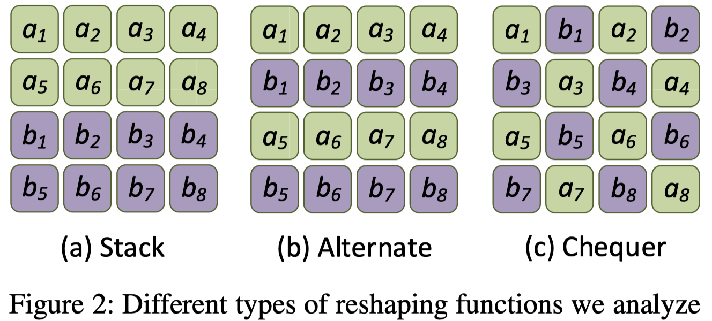
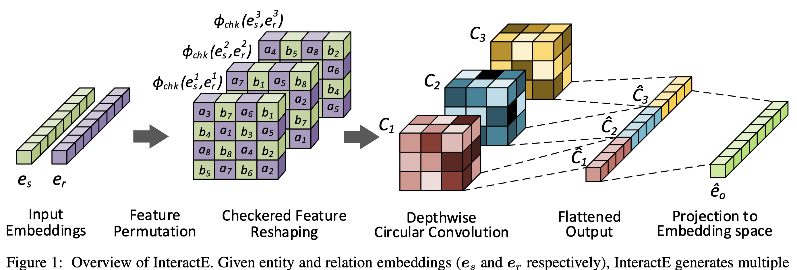
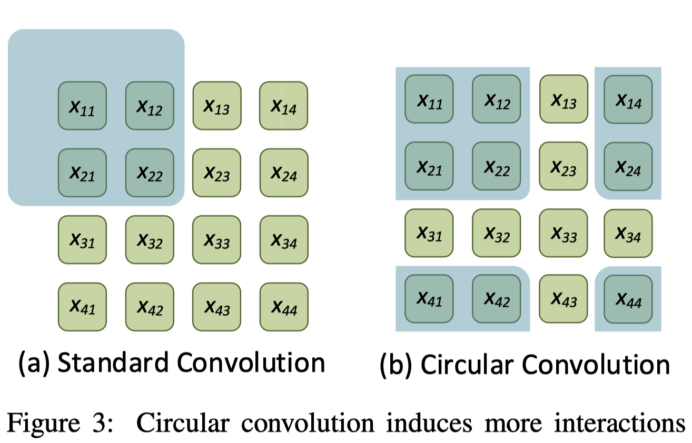
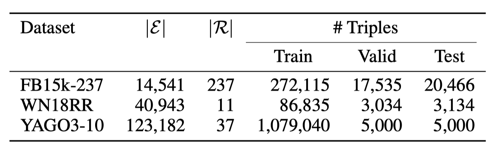
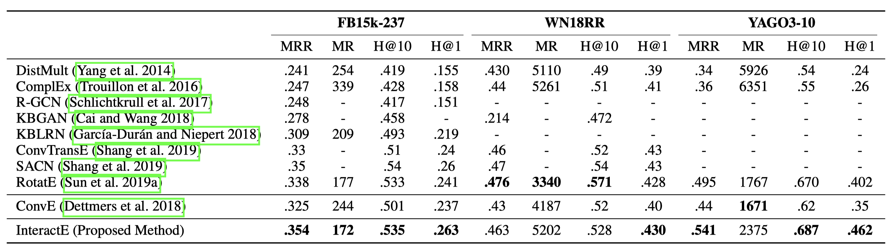
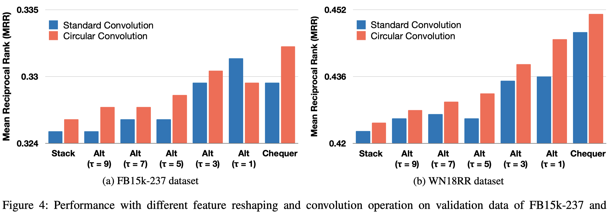
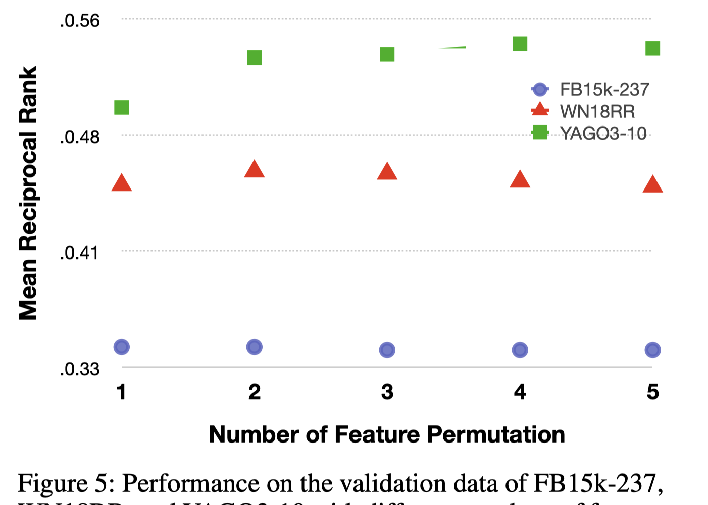
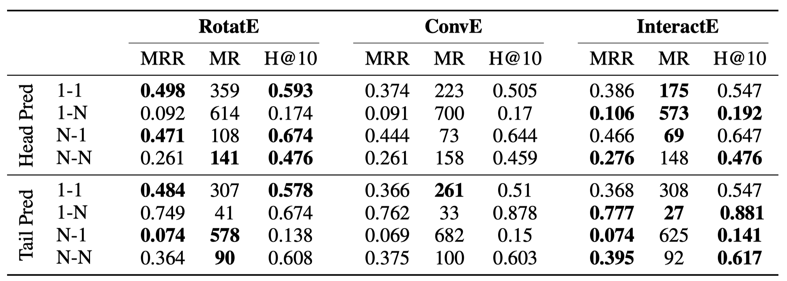

#  InteractE: Improving Convolution-based Knowledge Graph Embeddings by Increasing Feature Interactions

2019-11-12

在ConvE的基础上，进行了特征dim随机排列，棋盘状的排列，以及多channel的卷积。

<!--more-->

## 1 Introduction

由三元组表示的知识图谱在很多地方有广泛的应用：

- 关系导出
- 问题回答
- 规范化
- 推荐系统
- 对话系统

但是目前的知识图谱是imcomplete的，针对这个问题*link prediction*任务出现了。该任务的主要目标是根据已有知识图谱当中的事实(fact)来推测缺失的事实。常用的方法就是将所有的entity和relation转变为低维表示，然后利用这些低维表示通过一个得分函数（score function）来预测新的事实。

基于以上的思想，有几种不同类别的方法：

- 基于翻译距离的方法：TransE、TransH
- 基于语义匹配的方法：HoleE、ANALOGY
- 神经网络方法：NTN、ConvE

用CNN来学习KGE能够比一般的NN更有expressive，学习到非线性的信息；同时CNN本身就能保证参数效率，防止过度参数化。

## 2 Related Work

ConvE：
$$
\psi_r(e_s,e_o)=relu(vec(relu([\bar{e_s}; \bar{r_r}] \star \cal{w})) W)e_o
$$
在2018年提出来的ConvE存在interaction被限制的缺点，因此提出了InteractE期望能够解决该问题。

## 3 Notation and Definitions

实体$s$和关系$r$的$d$维表示：
$$
e_s=(a_1,\dots,a_d) \\
e_r=(b_1,\dots,b_d)
$$
Reshaping Function：
$$
\phi: R^d\times R^d=R^{m\times n}
$$
$\phi$函数有以下几种类型：$\phi_{stk},\ \phi_{alt},\ \phi_{chk}$

## 4 InteractE Details

总体结构

### 4.1 Feature Permutation

拿到向量$e_s,\ e_r$先进行特征随机排列，也就是对于$e_s=(a_1,\dots,a_d)\ 
e_r=(b_1,\dots,b_d)$进行随机排序。一共可以进行$t$次。得到，
$$
P_t=[(e_s^1,e_r^1),\cdots,(e_s^t,e_r^t)]
$$

### 4.2 Checkered Reshaping

对于上一步的结果，使用格子/棋盘reshape成二维矩阵，
$$
\phi_{chk}(P_t)=[\phi(e_s^1,e_r^1),\cdots,\phi(e_s^t,e_r^t)]
$$

### 4.3 Circular Convolution

循环卷积，
$$
[x\star \omega]_{p,q}=\sum_{i=-\lfloor {k/2}\rfloor}^{\lfloor {k/2}\rfloor} \sum_{j=-\lfloor {k/2}\rfloor}^{\lfloor {k/2}\rfloor} x_{[p-i]_m,\ [q-j]_n} \omega_{i,j}
$$

### 4.4 Score Function

$$
\psi_r(e_s,e_o)=g(vec(f(\phi(P_t) \star \cal{w})) W)e_o
$$

## 5 Experimental Setup

数据集

### 5.1 Performance Comparison

在整体性能的比较上来看，对于ConvE是有较明显的提升。同时在WN18RR数据集上的效果不显著。这一点和在ConvE里面发现的现象一致，因为这个数据集可能更适合于浅层的模型因为它的平均关联度就很低。

### 5.2 Effect of Feature Reshaping and Circular Convolution

探究重组方法以及循环卷积对于效果的影响。

可以看出来：

- 多数情况下，采用同样的reshape方式，循环卷积要优于标准卷积
- 随着interaction的增多，效果逐渐增强，而且循环卷积+棋盘式总能取得最好的结果

### 5.3 Effect of Feature Permutations

探究特征随机排列的次数对于模型结果的影响

可以观察到，实际上较小的组合数量就能够取得较优的结果，1/2次随机的排列组合就能够取得不错的结果。再增加组合次数会造成过度参数化。

### 5.4 Evaluation on different Relation Types

对于不同类型的关系进行预测的结果。

可以看出来首先InteractE是全面优于ConvE的；另外，它更善于建模N-1和N-N的关系，而RotatE更擅长建模1-1的关系。