# Collection of KGE Papers Volume 1

Collection of KGE papers, volume 1. 

Now it contains models of:

- HoLE (AAAI 2016)
- TACT(AAAI 2021)
- TransF(ICPR 2018)
- TransCoRe(JCST 2018)
- Interpreting-KGE(ICLR 2021)
- TuckER(EMNLP 2019)
- MLP for KGE(KDD 2014)
- TransH(AAAI 2014)
- TransA(arxiv 2015)
- TransR(AAAI 2015)
- TransD(IJNLP 2015)
- TransG(ACL 2016)
- CP for KGE(ICML 2018)
- SimplE(NIPS 2018)
- HypER(ICANN 2019)

<!--more-->

## HoLE

**Holographic Embeddings of Knowledge Graphs** AAAI 2016

这篇文章提出了holographic embeddings (HOLE)，来学习KG的compositional vector space representations。

**motivation**：However, existing embedding models that can capture rich interactions in relational data are often limited in their scalability. Vice versa, models that can be computed efficiently are often considerably less expressive.

**methods**：直接从subject entity embedding和object entity embedding中，使用circular correlation获得新的embedding，称作holograph embedding，然后使用这个holograph embedding与relation embedding做点积，得到预测概率。

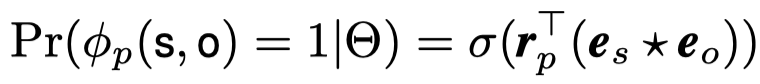

一个图示：

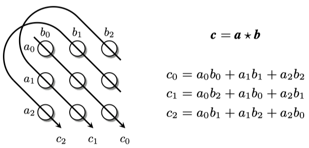

从这个图能够看出来，Circular Correlation可以看做是tensor dot的一种压缩方式，它的输出结果的每一维都是tensor dot结果的一部分。

## TACT

**Topology-Aware Correlations Between Relations for Inductive Link Prediction in Knowledge Graphs** AAAI 2021

[TACT](https://github.com/MIRALab-USTC/KG-TACT)，作者主要考虑的是inductive link prediction，使用gnn，捕获relation之间的语义上的关联性，即semantic correlation。作者认为relation之间的关联性通过relation的拓扑结构得到体现，因此，作者将所有的relation之间相连的拓扑结构分为7种，在relation形成的graph中进行学习，提出了RCN。

然后看一下整体结构：

## TransF

**Knowledge Graph Embedding with Multiple Relation Projections** ICPR 2018

基于翻译的方法，在TransR的思想上的改进。考虑了每个relation不是独立的，而是具有Correlation，比如关系*“/people/person/place_of_birth*和*/people/person/nationality*就有较强的相关性，比如居住在纽约的人大概率是美国人。为了解决这个问题，作者直接将每个relation独立的matrix分为一系列的basis space的组合，对于不同relation有不同的组合系数。

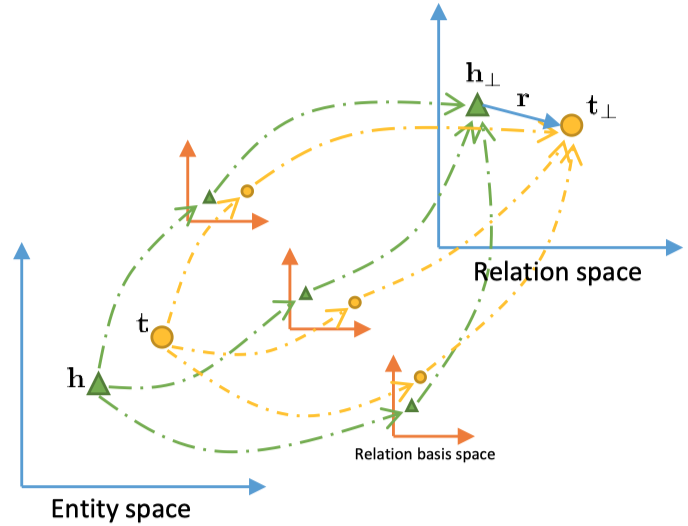

公式：

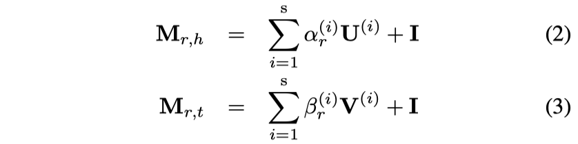

在实验中，在FB15k-237数据集上，作者使用了维度100，s数量5；在WN18RR数据集上，维度50，s数量5。最后使用TransR的方法投影：

## TransCoRe

**Modeling the Correlations of Relations for Knowledge Graph Embedding** JCST

作者考虑了关系之间的correlation，首先利用SVD和PCC方法分析了TransE这些方法学习到的relation embedding之间的相关性，然后发现在所有relation组成的matrix中，存在low-rank的structure。因此，作者直接将relation matrix拆分为两个矩阵的乘积，一个是通用矩阵，一个是关系矩阵，每一列对应不同的relation。
$$
\mathbf{R}=\mathbf{U}\mathbf{V}
$$
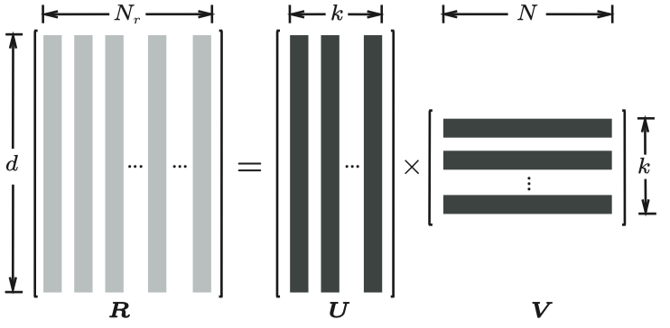

在这种情况下，矩阵$\mathbf{U}$的列是关系空间的basis

最后

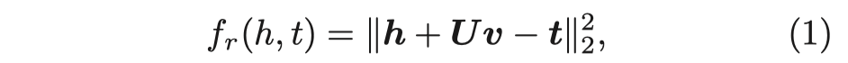

## Interpreting-KGE

**INTERPRETING KNOWLEDGE GRAPH RELATION REPRESENTATION FROM WORD EMBEDDINGS** ICLR 2021

从最新的基于PMI（pointwise mutual information (PMI)）的对于word embedding的理解角度出发，尝试从relation描述的subject和object entity的语义关联性角度进行解释；将所有的relation分为3类，并且解释了为了捕获它们的特征需要如何学习。

**很多地方没看懂。**

三个不同的分类：

- highly related (R); 
- generalised specialisation (S); 
- and generalised context-shift (C).

三者是包含关系，C>S>R

在WN18RR下不同关系的分类，

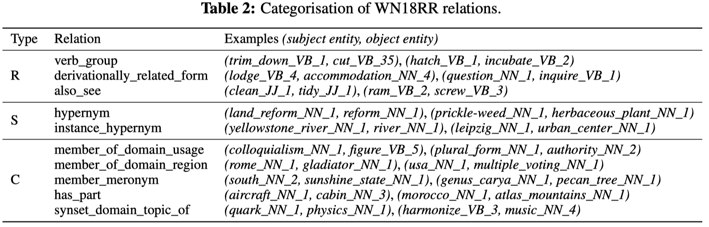

FB15k-237的relation大多是type C，也就是说该数据集中的relation没有特别明显的结构联系。

## TuckER

**TuckER: Tensor Factorization for Knowledge Graph Completion** EMNLP 2019

这篇文章使用1996年就被提出来的分解方法 Tucker decomposition，提出了TuckER，TuckER的主要结构如下：

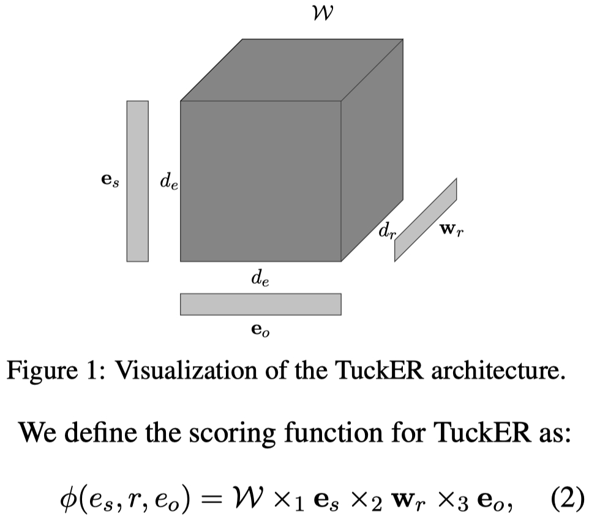

其中的参数$W$是所有关系共享的，$e_s,w_r,e_o$是subject, relation和object entity的embedding，都是向量化的表示。

具体计算公式是，沿着不同维度（mode）进行乘法运算

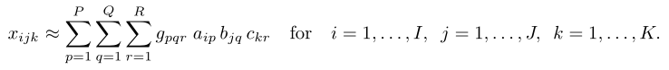

这篇文章可以考虑用来简化R-GCN中的$W_r$。

## MLP for KGE

**Knowledge Vault: A Web-Scale Approach to Probabilistic Knowledge Fusion** KDD 2014

这篇文章介绍了Knowledge Valult

> a Web-scale probabilistic knowledge base that combines extractions from Web content (obtained via analysis of text, tabular data, page structure, and human annotations)

在文章中，使用了MLP来获得KGE，主要用于评估构造的KG中的edge存在的概率，主要方法：

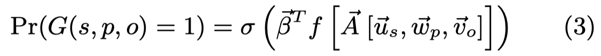

其中的$\beta \in \mathbb{R}^{L\times 1}$，$u_s, w_p, v_o$是subject、relation和object。

## TransH

**Knowledge Graph Embedding by Translating on Hyperplanes** AAAI 2014

这篇文章的贡献有两点

- 在TransE的基础上，提出了TransH，将subject和object entity投影到不同relation的超平面上，该超平面由一个法向量$w_r$决定，超平面上有一个偏移向量$d_r$，用于算头实体和尾实体投影之间的偏移。
- 使用了一个简单基于统计的，能够减小负采样错误率的方法。原理是one-to-many的relation应该倾向于替换head entity；many-to-one的relation倾向于替换tail entity。直接统计number of tail entities per head entity和number of head entities per tail entity，然后使用二元分布，计算替换head或者tail entity的概率。这种方法区别于以前的uniform的采样，可以叫做bernoulli采样。

TransH的结构：

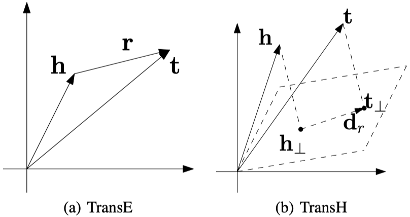

数学公式：

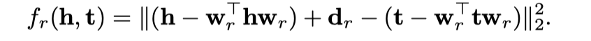

在训练中，保证$||w_r||_2=1$，同时$w_r \perp d_r$。

## TransA

**TransA: An Adaptive Approach for Knowledge Graph Embedding** arxiv 2015

这篇文章提出了一个新的计算loss的方法，将计算欧氏距离，换为计算马氏距离。

作者认为对于以前的loss形式过于简单

缺点两个：

- 这个loss metric实际是在计算一个球面等位超面spherical equipotential hyper-surfaces，这种方式过于简单，不够灵活，泛化

> Firstly, due to the inflexibility of loss metric, current translation-based methods apply spherical equipotential hyper-surfaces with different plausibilities, where more near to the centre, more plausible the triple is.

- 它实际是假设embedding的不同entry的weight在计算最终loss的时候一样

> Secondly, because of the oversimplified loss metric, current translation-based methods treat each dimension identically.

作者提出的新指标，将计算欧氏距离，换为计算马氏距离：

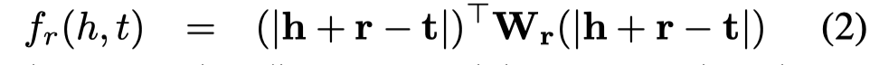

## TransR

**Learning Entity and Relation Embeddings for Knowledge Graph Completion** AAAI 2015

这篇文章改进了TransE和TransH认为embedding都在相同的semantic space中。TransR认为不同关系具有不同的space，实体在entity space下，提出了TransR。

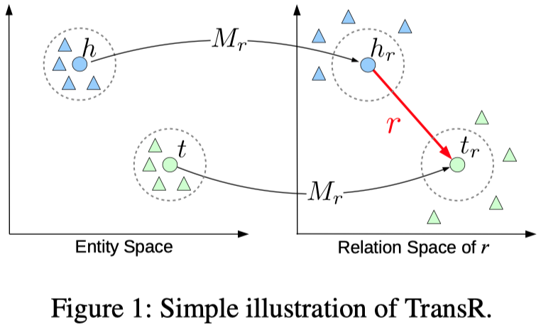

数学公式：

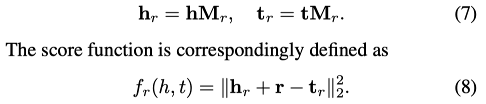

能够看到，还是有单独的relation embedding。

作者还提出了一个改进版，CTransR（Cluster-based TransR）。它对于一个单独的relation r，将不同的(head, tail)对分成几个不同的clusters，不同的clusters拥有自己的relation vector $r_c$，整个relation下的所有clusters有一个共同的relation vector $r$，此时的scoring function为：

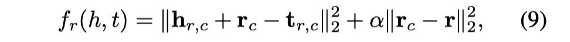

## TransD

**Knowledge Graph Embedding via Dynamic Mapping Matrix ** IJCNLP 2015

作者将所有的entities和relations都赋予了两个vectors，一个vectors和以前的embedding一样，作为实体和关系的向量化embedding；一个vectors用来构件转换矩阵：

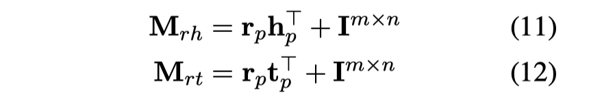

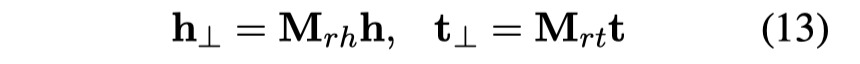

## TransG

**TransG : A Generative Model for Knowledge Graph Embedding** ACL 2016

这是第一篇在KGE上使用generative model的论文，第一次明确提出并且讨论**multiple relation semantics**，即一个relation可能有不同的语义含义，这个语义含义是由它链接的头/尾实体决定的。

> In spite of the success of these models, none of the previous models has formally discussed the issue of multiple relation semantics that a relation may have multiple meanings revealed by the entity pairs associated with the corresponding triples.

为了让relation有更多不同的表示，作者使用Bayesian non-parametric infinite mixture embedding model [1]的思路，为每个relation都学习多个不同的component。

[1] The indian buffet process: An introduction and review.

对生成模型不了解，这篇文章没有细读。

## CP for KGE

**Canonical tensor decomposition for knowledge base completion** ICML 2018

[https://github.com/facebookresearch/kbc](https://github.com/facebookresearch/kbc)

作者集中在使用canonical decomposition of tensors (also called CANDECOMP/PARAFAC or CP)来学习KGE。对于CP的改进集中在两方面：

- 引入关系的逆关系，分别具有不同的表示，显示使用这种办法能够很好的提升效果
- 使用tensor nuclear p-norms正则化CP，虽然最后结果显示没有很显著的提升CP效果

最终效果没有超越ComplEX，但是提升CP效果很多。

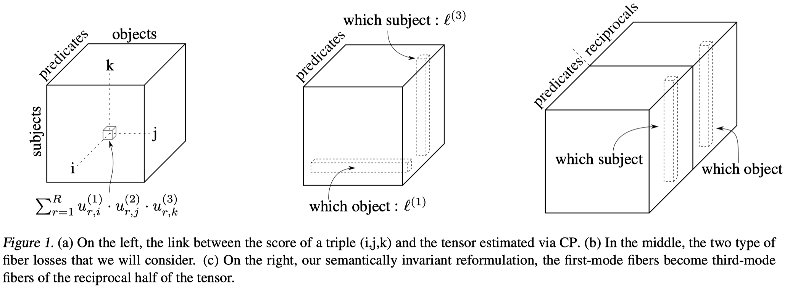

CP分解：

其中的$\mathbf{X}$是整个KG张量。

后续调研张量分解的方法可以从这篇文章出发。

## SimplE

**SimplE Embedding for Link Prediction in Knowledge Graphs** NIPS 2018

[SimplE](https://github.com/Mehran-k/SimplE) 使用CP分解，改进了一般的CP分解，与一般的CP分解一样，每个entity有两种表示对于head和tail，每个relation有唯一的表示。在预测triple是否成立时，同时用原关系和逆关系是否成立进行平均打分。在论文中，作者证明了SimplE是fully expressivene的。

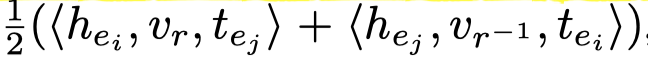

其中的$<>$函数定义为：

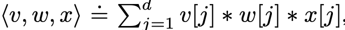

## HypER

**Hypernetwork Knowledge Graph Embeddings** ICANN 2019

