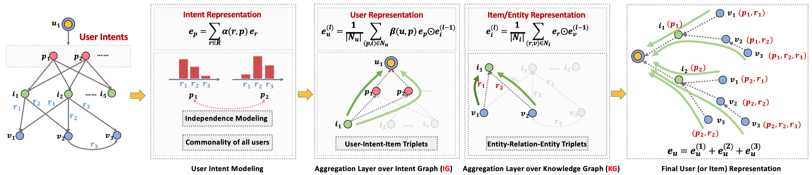
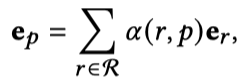
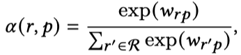
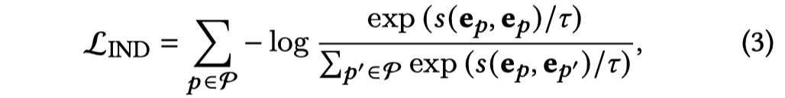
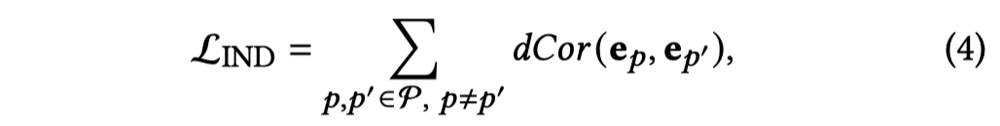
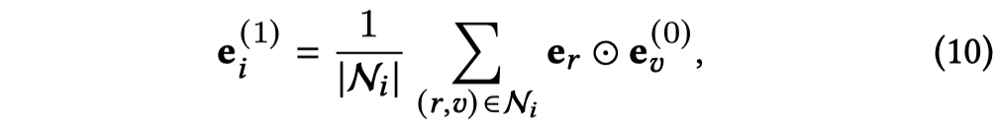
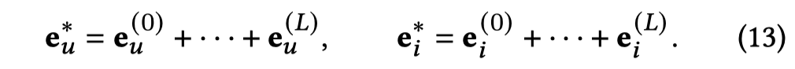
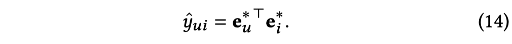
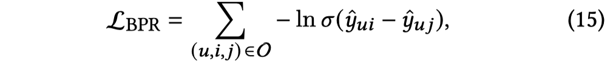
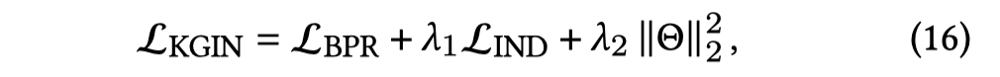

# Learning Intents behind Interactions with Knowledge Graph for Recommendation

KGIN，WWW 2021

结合知识图谱，结合图神经网络。在user-item中加入了intent，在KGIN中的intent表现为知识图谱中关系relation的基于自注意力的组合，同时加入差异性约束，使得不同intent的差异增大。Intent的想法很有趣，直观上看本质上还是多头的，类似于集成学习ensemble learning的思想。

<!--more-->

> Knowledge graph (KG) plays an increasingly important role in recommender systems. A recent technical trend is to develop end- to-end models founded on graph neural networks(GNNs). However, existing GNN-based models are coarse-grained in relational modeling, failing to (1) identify user-item relation at a fine-grained level of intents, and (2) exploit relation dependencies to preserve the semantics of long-range connectivity.
>
> In this study, we explore intents behind a user-item interaction by using auxiliary item knowledge, and propose a new model, Knowledge Graph-based Intent Network (KGIN). Technically, we model each intent as an attentive combination of KG , relations, Negative Items : Positive Items encouraging the independence of different intents for better model capability and interpretability. Furthermore, we devise a new information aggregation scheme for GNN, which recursively integrates the relation sequences of long-range connectivity (i.e., relational paths). This scheme allows us to distill useful information about user intents and encode them into the representations of users and items. Experimental results on three benchmark datasets show that, KGIN achieves significant improvements over the state-of-the-art methods like KGAT [41], KGNN-LS [38], and CKAN [47]. Further analyses show that KGIN offers interpretable explanations for predictions by identifying influential intents and relational paths. The implementations are available at [https://github.com/huangtinglin/Knowledge_Graph_based_Intent_Network](https://github.com/huangtinglin/Knowledge_Graph_based_Intent_Network).
>

直接看方法：

整个模型的训练分成两个部分，一个是user-item上对于user embedding的训练，一个是在KG上对于entity/item的训练。

## 在user-item graph上的训练。

首先引入intent，定义一个集合$\mathcal{P}$对于所有的用户是共享的，然后针对user-item pair $(u,i)$，插入intent，变为$\{ (u,p,i)\ p \in  \mathcal{P} \}$。

**Representation Learning of Intents**：

每一个intent $p$对应一个表示embedding，同时为了让intent能够与KG中的relation联系起来，考虑不同relation的组合作用，将intent表示为基于注意力的relation的组合：

KGIN为每个relation针对不同的intent $p$定义了一个weight，$w_{rp}$。不是简单的直接weighted sum而是经过了一层softmax。

另外，为了保证intent embedding之间存在差异性，对于不同的intent $e_p$，使用了两种方法作为惩罚项加入loss function中。

1. Mutual information

2. Distance correlation

以上的思想是精髓，需要之后细看，并且类似的思想在中也有出现。

在得到了intent $p$之后，聚合item，得到user的表示：

注意力的聚合，计算每个intent与目标用户embedding的相似程度。

## 在KG上的训练

不使用注意力，也没有intent，甚至也没有$W$，直接聚合

需要注意：$e_r$在intent embedding计算中出现，并且看公式的话，它不会随着layer的增加而改变。

## Model Prediction

## Model Optimization

