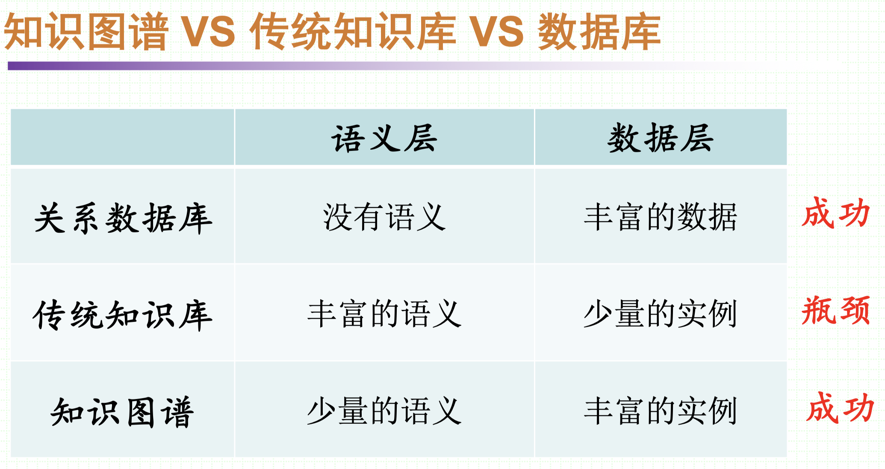
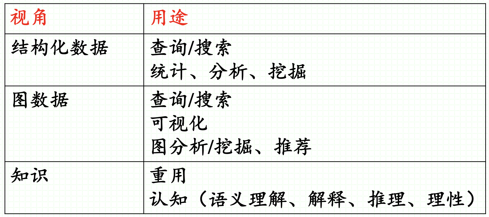
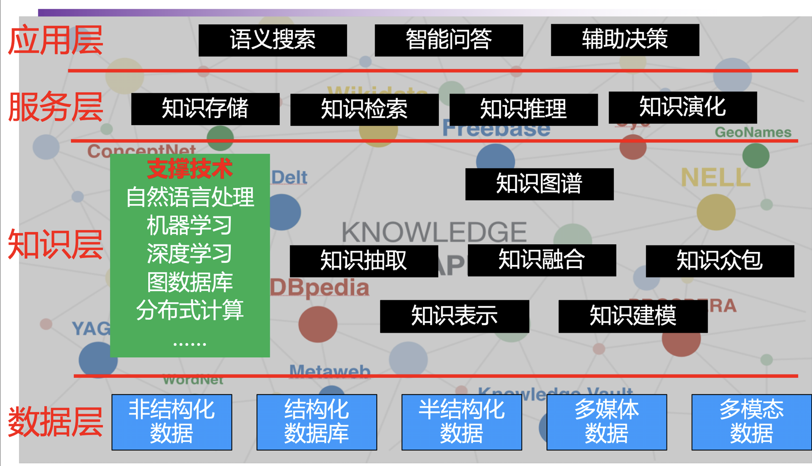
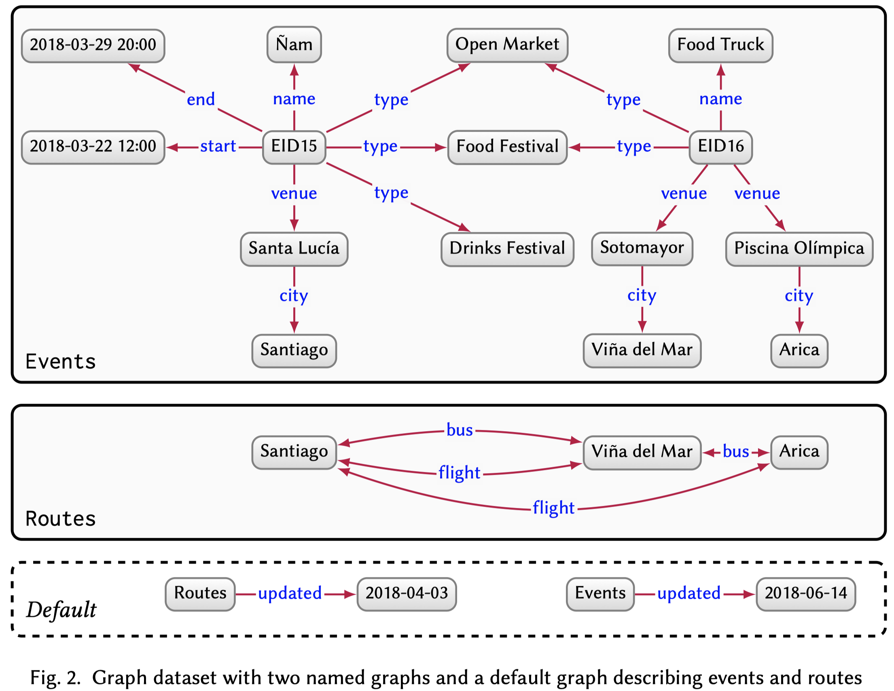
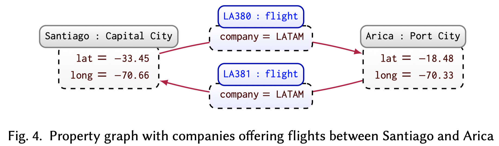
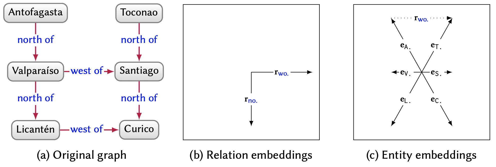
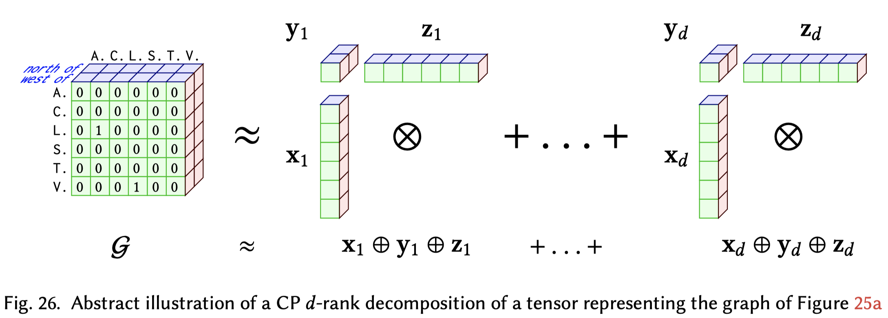

# Knowledge Graphs

Introduction of Knowledge Graphs.

<!--more-->

> 1. HOGAN A, BLOMQVIST E, COCHEZ M, et.al. Knowledge Graphs[J]. arXiv:2003.02320 [cs], 2020.
> 2. Knowledge Graph Embedding: A Survey of Approaches and Applications
> 3. 东南大学知识图谱课程笔记，[原项目地址]( https://github.com/npubird/KnowledgeGraphCourse)。
> 4. [从知识图谱到认知图谱： 历史、发展与展望](https://mp.weixin.qq.com/s/RK0bymmcXloxzCBYOPk6wg)
> 5. [StandFord的课程《knowledge graph》2020](https://web.stanford.edu/class/cs520/)

## 1. INTRODUCTION

Knowledge graph这个词的现代含义是从2012年谷歌知识图谱（Google knowledge graph）提出后才具备的。谷歌使用知识图谱增强搜索引擎检索效果。

首先需要搞清楚几个重要的概念。

一、什么是知识？

有很多的定义

> 1. Knowledge is a familiarity, awareness, or understanding of someone or something, such as facts, information, descriptions, or skills, which is acquired through experience or education by perceiving, discovering, or learning.——维基百科
> 2. 知识包括两部分：已知的和未知的，实际对于所有涉及知识都是这两方面的研究

简单理解知识的例子：110，110本身是没有意义的，它只是计算机表示的符号。但是我们知道，认识到110可以是一百一十，可以是2进制，可以是中国的报警电话。它在不同的情景下有不同的具体含义，表达了除去110符号之外的现实含义。这就是知识。

二、什么是语义？

根据它原本的定义，语义就是语言包含的意义。语义可以简单地看作是数据所对应的现实世界中的事物所代表的概念的含义，以及这些含义之间的关系，是数据在某个领域上的解释和逻辑表示。

三、什么是本体？

**Ontology**的定义，据维基百科

> In computer science and information science, an ontology is a **formal naming and definition of the types, properties, and interrelationships of the entities** that really or fundamentally exist for **a particular domain** of discourse. It is thus a practical application of philosophical ontology, with a taxonomy.

具体的理解，引用知乎的[答案](https://www.zhihu.com/question/34835422/answer/60367501)

> 我浅显的理解，本体就是这个知识库本身的**存在，**也就是知识库中对知识的一个定义，定义这个知识库中具体的每一个知识到底是什么。【本体论（英语：Ontology），又译存在论、存有论，它是形而上学的一个基本分支，本体论主要探讨存有本身，即一切现实事物的基本特征。】就好像有一匹马叫赤兔，那么马这个概念才是本体，赤兔红兔什么的无所谓；有一个美女叫貂蝉，那么美女这个概念才是本体，貂蝉西施啊什么的也无所谓。

一句话概括本体，形式化、正式的概念定义。

四、本体、知识库（knowledge base）、知识图谱（knowledge graph）之间的关系？

还是引用知乎的[答案](https://www.zhihu.com/question/34835422/answer/144387604)

> 从抽象层面看，本体最抽象，其次是知识库，最后才是知识图谱。举个例子，如果我们要做图书领域的知识库或者知识图谱，首先要对图书进行分类，这个分类就是本体，比如说，图书分为计算机类和电子类，计算机类有分为网络、人工智能；有了这个分类后，我们就可以把图书都分到每个类别，比如说《Zero to One》是一本进口原版书，然后这本书有各种属性－属性值，比如说书的作者是Peter Thiel，这些数据就构成了一个图书知识图谱（前面讲的分类可以认为不是这个知识图谱的一部分），而这里分类和知识图谱一起可以看成是一个图书知识库。也就是说，**本体是强调概念关系**，**知识图谱强调实体关系和实体属性值**，**知识库则是所有知识的集合。但是知识库不局限于分类和图谱，知识库可以包括规则，包括过程性知识等**。而本体也可以定义得很抽象，任何概念的内涵和外延可以定义本体。

知识图谱获得了很多的研究关注，核心是在于使用图表示数据，进而使用图表示知识的思想。使用图表示知识的好处，和关系型的数据结构比较起来，有以下的优点：

- 图能够提供很多领域下一种准确、直观的抽象。使用图描述数据的时候，可以一开始不确立一个准确的定义，而是随着发展慢慢的定义。
- 在图上也有查询语言，不仅能够支持传统的查询操作（join、unions、 projections），也能够在图上递归的查询。
- 标准的知识表示形式，比如ontologies和rule，都可以被用来描述和推理图中的节点

knowledge graph的一个归纳的定义：

> A graph of data intended to accumulate and convey knowledge of the real world, whose nodes represent entities of interest and whose edges represent relations between these entities.

在认识论里，对于知识已经有了很多的讨论。这里粗略的理解knowledge就是something that is known。知识图谱中的知识可以从外部累积，也可以从内部导出。使用Deductive methods/Inductive methods都可以导出新的知识。

> 演绎Deductive是从一般到个别
>
> 归纳Inductive是从个别到一般

知识图谱的构造可以用到很多数据来源，这些数据来源的结构、粒度各不相同。因此，构造知识图谱需要定义三方面的内容。

1. schema：知识图谱的高层次的结构定义
2. identity：确定知识图谱或不同来源的描述对象是否指向现实世界中相同的实体
3. context：context may indicate a specific setting in which some unit of knowledge is held true

知识图谱不断成长和提升需要涉及的方面有：

- extraction
- enrichment
- quality assessment
- refinement

实践当中，按照知识图谱的开放程度，分为open knowledge graph和enterprise knowledge graphs两类。前者对公众开放，比如：DBpedia, Freebase, Wikidata, YAGO。后者主要是公司内部使用，Bing, Google, Airbnb, Amazon, eBay

实际上本质的，知识图谱获得成功要得益于它的特点——弱语义，多实例

不需要多强的语义，因为现实世界是如此的复杂，以至于我们不可能概括一个通用的、泛化性强的规则/语义去描述全部的现实世界。但语义又是必须的，没有语义的话，就没有知识，知识图谱的本身就不成立了。所以，知识图谱着眼于弱语义，同时看重实例的堆积，反而取得了成功，并且在快速的发展。

知识图谱的研究热点逐渐出现重数量轻结构化的倾向，

知识图谱怎么用？

宏观角度看知识图谱

知识图谱的缺点：

知识图谱的缺点本质上都是“⼆元⼀阶谓词逻辑”作为知识表示本身的缺陷带来的。词逻辑”作为知识表示本身的缺陷带来的。⻓久以来，知识 表示是研究者孜孜不倦追寻探索的话题，完全依靠（头实体，关系，尾实体）这样的命题，尽管能表示⼤部分简单事件或实体属性，但对于复杂知识却束手无策。

比如“克隆⽺的各项属性都与本体相同”，这个知识就无法被现有的知识图谱结构很好的记录。

另一方面，在构建知识图谱的过程中，从原始的语音、图像等的信息约减带来的实体链接困难。知识的最终来源是我们所处的世界，从原始的语⾳、图像等数据到⽂本再到知识图谱，信息量不断被约减，只有最核⼼的内容被保留下来。然⽽，忽略了原始⽂本中⼈物的具体经历等信息后，会导致同名⼈物难以消歧。

因此，现在有出现认知图谱，动力在于自然语言处理的进步，核心在于保持知识图谱的图结构带来的可解释性与精准稳定的推理能力的同时，带来推理能力的改变。

## 2 DATA GRAPHS

在这个部分我们讨论几种常见的知识图谱类型。

### 2.1 Directed edge-labelled graphs

是最常见，也是我们默认讨论知识图谱时具备的结构。它由节点集合与有向边集合组成。关系都是二元关系。一般使用RDF定义，可以进行各种查询操作。

### 2.2 Graph dataset

A graph dataset then consists of a set of named graphs and a default graph.

即多个知识图的集合。

### 2.3 Property graphs

属性图谱是在一般的知识图谱基础上改进的，A property graph allows a set of property–value pairs and a label to be associated with both nodes and edges.在边上添加了属性和标签。

### 2.4 Other graph data models

例如hypergraph：complex edges that connect sets rather than pairs of nodes

## 3 DEDUCTIVE KNOWLEDGE

给予一些先验的知识，一些规则等，就可以在知识图谱上进行对于新知识的演绎。一些通用的规则，很多人都了解的知识被称为*commonsense knowledge*，相反的，只被相关领域的专家了解的知识叫做*domain knowledge*。

为了能够准确的构建知识图谱，我们必须首先确定涉及的term的准确定义，这就是本体*Ontologies*。描述本体的形式化语言是OWL（Web Ontology Language）。

在知识图谱中，普遍存在四种假设

- Closed World Assumption (CWA)：未知的知识一定不成立
- Open World Assumption (OWA)：未知的知识有可能成立
- Unique Name Assumption (UNA)：不同的实体一定对应现实世界的不同事物
- No Unique Name Assumption (NUNA)：不同的实体可以对应现实世界的同一事物

OWL是基于OWA，NUMA假设的。

演绎知识主要集中在推理方面，比如利用构建知识图谱时用到的本体，本体中的各种概念会构成一张图。利用预先知道的规则/逻辑，演绎推理出新的知识。这样得到的知识是很精确的。集中的表现是预先知道规则rule/描述逻辑Description Logics (DLs)，然后在graph中寻找能够匹配的现实。rule的一般表现是if-then类型的类似路径的序列。DL一般采用一阶逻辑FOL。

> A rule is composed of a body (if) and a head (then). Both the body and head are given as graph patterns. A rule indicates that if we can replace the variables of the body with terms from the data graph and form a subgraph of a given data graph, then using the same replacement of variables in the head

> Description Logics (DLs) were initially introduced as a way to formalise the meaning of frames and semantic networks. Initially, DLs were restricted fragments of First Order Logic (FOL) that permit decidable reasoning tasks.

## 4 INDUCTIVE KNOWLEDGE

> inductively acquiring knowledge involves generalising patterns from a given set of input observations, which can then be used to generate novel but potentially imprecise predictions. Graph analytics is then the application of analytical processes to (typically large) graph data.

由于一般归纳的知识再用于预测无法得到绝对正确的预测，因此一般提供*confidence*。

### 4.1 Graph analytics

> Analytics is the process of discovering, interpreting, and communicating meaningful patterns inherent to (typically large) data collections

各种的图分析技术：

1. Centrality：衡量节点的重要程度。to identify the most important (aka central) nodes or edges of a graph.
2. Community detection：探测节点之间的聚类。to identify communities in a graph, i.e., sub-graphs that are more densely connected internally than to the rest of the graph.
3. Connectivity：评估图的连通性。to estimate how well-connected the graph is, revealing, for instance, the resilience and (un)reachability of elements of the graph.
4. Node similarity：发现节点的相似程度。to find nodes that are similar to other nodes by virtue of how they are connected within their neighbourhood.
5. Path finding: 一般是发现两个节点之间的可能路径。to find paths in a graph, typically between pairs of nodes given as input.

上述的图分析技术已经在图领域当中进行了深入的研究，存在很多的图框架适合于分析图，比如Apache Spark (GraphX), GraphLab, Pregel, Signal–Collect, Shark。

但是还不能直接把上面的图分析技术应用到知识图谱上，因为知识图谱是有向带标签的图。因此，有几种不同的方案处理这一问题。

1. Projection：移除边的类型得到一个无向或者有向图
2. Weighting：设计某些方法，将边的元数据转化为数字
3. Transformation：将原来的图进行转换——lossy/lossless，前者表示转化后的图无法复原原来的图；后者表示可以复原原来的图，比如把原来的边的标签表示为新的节点，新的边变为无标签的
4. Customisation：改变之前的图分析技术，加入对边的考虑

具体选择哪种方法没有特定的方式，依赖于具体的技术。

一个可能的研究方向是结合语义和图分析技术，研究*semantically-invariant analytics*，因为之前的图分析技术无法利用具体的语义信息，比如逆关系/不可逆关系。

### 4.2 Knowledge Graph Embeddings/KRL

知识图谱嵌入的核心目的是创建出knowledge graph在低维、连续空间下的稠密表示。

它实际上是知识图谱表示学习目前的主流思想，都是把表示转化为embedding。基本可以划等号。

**表示学习**：将研究对象的语义信息表示为稠密低维的实值向量，举例：文字、图片、语音

**知识表示学习**：将知识库/知识图谱中的实体和关系表示为稠密低维的实值向量

**知识**：知识图谱中的知识通常就是三元组（head, relation, tail）

知识表示中存在的问题，设想怎么样能够表示三元组？

1. 0-1的onehot编码，每个实体/关系有唯一的编码，信息基本全丢失，不可用

2. 直接使用图结构的图算法复杂度高

3. 数据稀疏问题：长尾/重尾分布（大量的实体处在长尾上）

研究知识图谱嵌入的意义：

1. 低维向量提高计算效率

2. 稠密的向量缓解数据稀疏问题

3. 多源的异质信息表示形式统一，便于迁移和融合

一般的评测任务

- 链路预测
- 实体分类
- 图分类

知识图谱嵌入一般的应用：

- 知识融合，如Cross-lingual Entity Alignment via Joint Attribute-Preserving Embedding
- 人机交互，如Commonsense Knowledge Aware Conversation Generation with Graph Attention

根据经典的survey，中所有的KGE从利用信息的角度分为两类：KG embedding with facts alone（仅使用facts）和Incoprorating additional information（多源信息融合）。从使用的模型核心方法的角度讲，根据[1]又可以划分为Translational models、Tensor decomposition models、Neural models。实际上人们也经常根据得分函数scoring function，直接分为Translational Model和Semantic Matching Models，前者的scoring计算entity embedding之间基于关系的距离，后者的scoring function基于相似度计算事实成立的得分。

> *Translational distance models* exploit distance-based scoring functions. They measure the plausibility of a fact as the distance between the two entities, usually after a translation carried out by the relation.
>
> *Semantic matching models* exploit similarity-based scoring functions. They measure plausibility of facts by matching latent semantics of entities and relations embodied in their vector space representations.

在这里，我们主要关心方法本身，根据模型进行分类。

#### 4.2.1 基于翻译的模型

起始于TransE，

TransE的不足：

- 首先，TransE严格要求有效的三元组满足头实体加关系在向量空间中与尾实体足够靠近，可以很好地处理一对一关系，但在处理多映射属性关系时，存在多个实体竞争一个点的现象．例如在一对多关系中，同一个头实体$h$与多个尾实体$\{t_1,t_2\cdots\}$存在关系$r$，由于$h+r=t_i,f=\{1,2,\cdots\}$的约束，这些尾实体将竞争空间中的同一个点，即使它们语义差别很大，因而会造成向量空间的拥挤和误差；
- 其次，TransE只专注于满足知识图谱中的三元组约束，然而知识图谱中存在大量层级关系，例如在知识图谱WordNet的子集WN18中，大约有50%的层级关系，孩子关系就是一种层级关系，对应的实体和关系形成树结构．Li等人也指出，考虑层级结构有助于推理：
- 然后，TransE没有考虑丰富的语义信息，缺乏对空间中向量分布位置的进一步调整；
- 再者，TransE在单个知识图谱上进行学习推理，而单个知识图谱知识量有限；
- 此外，TransE参数的选取与知识图谱数据独立，不能反映数据的特点；
- 同时，TransE未考虑知识的时间约束。

因此，诞生了一系列的Trans系列的方法。TransH, TransR, CTransR, TransD, TranSparse, TransM, ManiFoldE, TransF, TransA, KG2E, TransG。

#### 4.2.2 张量分解模型

这一方法的核心是将整个图表示为一个张量$G$（tensor，就是多阶向量），0/1表示某个边是否存在，之后将所有的实体和关系表示为$d$维的embedding，每个维度都代表某种能够对预测结果产生影响的latent factor，这样理由d个latent factor去尝试重建表示图的张量$G$。

> A tensor is a multidimensional numeric field that generalises scalars (0-order tensors), vectors (1-order tensors) and matrices (2-order tensors) towards arbitrary dimension/order.

下图是关于CP d-rank分解的实例，图中的$x_i,y_i, z_i$表示的是在$x,y,z$三个方面的第$i$种latent factor。

这一类型的方法有LFM， RESCAL，DistMult，ComplEx，ANALOGY，HolE。

#### 4.2.3 神经网络模型

上面的这些方法都是linear或者billear的scoring function，之后就有人使用non-linear的神经网络方法学习embedding。

一般的神经网络方法包括SME、NTN、MLP。但它们的问题在于容易过拟合，如果想要效果较好就需要较大的embedding维度，但这毫无疑问是不可接受的（由于数量巨大的实例数量）。

之后就出现了很多其它网络模型，包括使用CNN、RNN、GNN等。

CNN在知识图谱上的应用源于ConvE，之后发展出一系列的方法，ConvR、ConvKB、HypER、InteractE等。

使用RNN实际上是受到了word embedding的启发。例如基于word2vec和random work找寻路径的RDF2Vec，融合GloVe和PageRank的KGloVe。

基于GNN是得益于最近图神经网络的突飞猛进，模型有R-GCN，VR-GCN，COMPGCN，KBGAT等。这个方向还有很多可以研究的内容。

对于GNN目前没有统一全面的认识，简单说明，主要有两类GNN，一类是Recursive graph neural networks，一类是Convolutional graph neural networks。

Recursive graph neural networks的思想起源于The Graph Neural Network Model（2009），核心是对于graph中的每一个node/edge都有一个feature vector和一个hidden state vector，state vector不断aggregate邻居节点的信息获得新的state vector，使用transition function和邻居节点的feature vector构造要传递的信息，之后使用output function输入新的state vector得到最终的预测结果。至于什么时候停止要看是否能够达到fixpoint。

Convolutional graph neural networks是模拟了CNN处理图像的思想，但是与图像的区别在于无法很好的定义neighbour。这个方向又可以分为基于spectral和基于spatial的方法。

两类GNN方法的区别：

> There are two main differences between RecGNNs and ConvGNNs. 
>
> - First, RecGNNs aggregate information from neighbours recursively up to a fixpoint, whereas ConvGNNs typically apply a fixed number of convolutional layers. 
>
> - Second, RecGNNs typically use the same function/parameters in uniform steps, while different convolutional layers of a ConvGNN can apply different kernels/weights at each distinct step.

#### 4.2.5 融合多元信息的模型

这里的多源是指除单纯的三元组之外的信息

1. 实体类别：同一类别的实体在表示空间中应该距离较近
   - SSE、TKRL
2. 关系路径：三元组与三元组可以拼接为路径
   - pTransE
3. 文本描述：每个实体/关系都有自己名字
   - NTN：先用新闻语料库对词汇进行表示，然后用词汇表示初始化实体的表示
4. 逻辑规则：融合逻辑规则，学习知识表示
   - ILP、KALE
5. 实体属性：大部分KGE将实体属性也看做关系处理，但是有时并不合理。例如（Obama，gender，male）
6. 时序信息：在三元组的基础上添加时间维度

### 4.4 Symbolic Learning

之前谈到的演绎的知识，它的规则或者DL都是可以通过已有的知识图谱中归纳出来的。如果我们能够挖掘出这样的规则，那么就可以为我们预测未知的链接是否存在提供可解释的依据。只不过是这样归纳的规则不一定是正确的。

上面自动归纳规则的方法就是Symbolic Learning：

> An alternative (sometimes complementary) approach is to adopt symbolic learning in order to learn hypotheses in a symbolic (logical) language that “explain” a given set of positive and negative edges.

主要分为两大类，Rule mining和Axiom mining。

Rule mining的主要目标：

> The goal of rule mining is to identify new rules that entail a high ratio of positive edges from other positive edges, but entail a low ratio of negative edges from positive edges.

从Inductive Logic Programming (ILP)开始已经有很多对于规则挖掘的探讨，但是由于知识图谱的规模大以及不完备性，又有很多新的专用方法出现。

一个非常重要的方法是AMIE，它是利用启发式的方法不断构造新的规则，然后判断这些规则在已有的facts中是否成立，confidence是否够高。之后还有很多的改进方法比如AMIE+，Gad-Elrab，RuLES，CARL等。

另外一种流派是认为矩阵乘法可以表示规则推导，叫做differentiable rule mining，The core idea is that the joins in rule bodies can be represented as matrix multiplication。这一类的方法有NeuralLP，DRUM等。

Axiom mining是自动挖掘DL的方法。

## 5 QUALITY ASSESSMENT

在知识图谱创建或者从不同的来源获得更新之后，需要对知识图谱的质量进行评估。

四个被广泛使用的评估维度

### 5.1 Accuracy

准确度是指要求知识图谱中的实体和关系能够准确的反映现实世界中的事物。

> Accuracy refers to the extent to which entities and relations – encoded by nodes and edges in the graph – correctly represent real-life phenomena.

- Syntactic accuracy：语法的准确性是指知识图谱中的数据是不是准确符合定义的语法。一种度量指标就是错误的实例的比例。
- Semantic accuracy：语义准确性是指数据是否正确的对应了现实，比如由于不恰当的知识抽取导致出现了错误的实例。一种度量的方法是拿知识图谱和多个对应的数据来源自动进行对比。
- Timeliness：时间线是指知识图谱能够及时得到更新的度量。可以用多久进行一次更新进行度量。

### 5.2 Coverage

覆盖范围/覆盖程度主要是指与领域相关的信息丢失的程度。

> Coverage refers to avoiding the omission of domain-relevant elements, which otherwise may yield incomplete query results or entailments, biased models, etc

- Completeness：完备性是指知识图谱包含所有信息的程度。包括预先定义的schema是否完备（schema completeness）、属性对应的值是否完备（property completeness）、现实当中所有的实体和关系是否完备（population completeness）、已有实体之间的联系是否完备（linkability completeness）。
- Representativeness：代表性是关注当前的知识图谱的biases。比如人口方面的知识图谱偏向反映某个地区/人种的信息。一种度量方式是拿知识图谱与当前已知的统计分布进行对比。

### 5.3 Coherency

一致性是指知识图谱中的实例在语义/约束是否一致。

> Coherency refers to how well the knowledge graph conforms to – or is coherent with – the formal semantics and constraints defined at the schema-level.

- Consistency：一致性是指知识图谱内部信息是否互相矛盾。
- Validity：有效性是指知识图谱是否与预先的约束冲突。

### 5.4 Succinctness

简洁性是指要求知识图谱只包含准确，足够的内容，避免冗余信息。

> Succinctness refers to the inclusion only of relevant content (avoiding “information overload”) that is represented in a concise and intelligible manner.

- Conciseness：简洁性是指知识图谱的schema和已有的数据是否存在于领域无关的情况。
- Representational-conciseness：代表的简洁性是要求知识图谱已有数据是紧密联系的，避免出现同一个概念不同的实体/关系。
- Understandability：可理解性是指知识图谱的内容能够无歧义的被人类理解。

## Review previous work

现在回顾之前的工作，用的方法是神经网络模型，主要利用GNN做encoder，CNN做decoder，最后输出semantic socres。预测任务是link prediction，设想的场景是knowledge graph completion，该场景属于对于已有知识图谱质量中完备性的提升（refinement），方法是补全已有的实体和关系之间的联系。核心是学习knowledge graph embedding，学习到的是inductive knowledge，没有涉及多元信息的融合。

可以改进的方向：

1. 从GNN的角度入手，目前可以想到的是改进注意力机制
2. 从知识图谱角度入手，比如考虑在聚合一阶邻居的时候区分出属性和一般的关系、还可以考虑加入多步路径

 