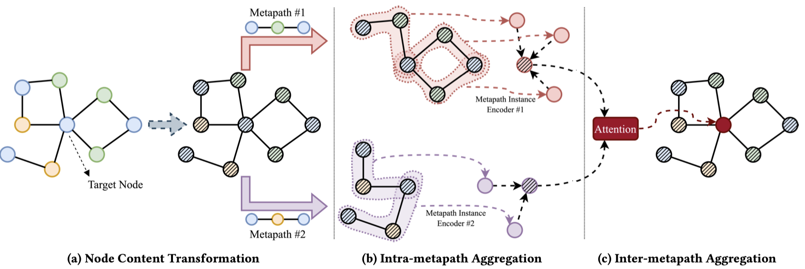
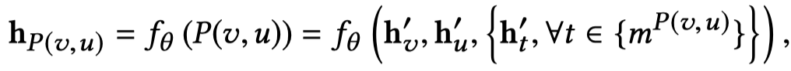
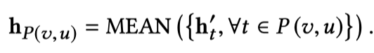
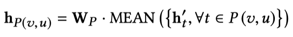
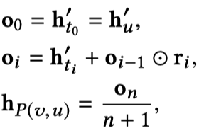
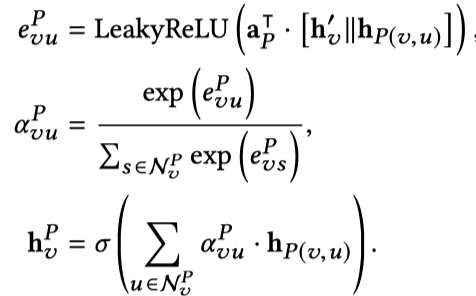
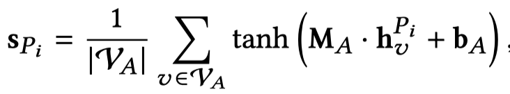
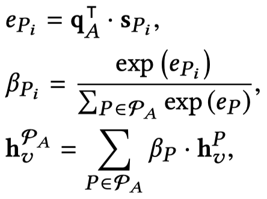

# MAGNN: Metapath Aggregated Graph Neural Network for Heterogeneous Graph Embedding

看一下整体结构：

**Motivation**：

对于GNN，大部分的GNN假设graph是同质图，但是很多实际的graph都是异质图。

对于处理异质图的传统方法，是基于meta path的方法。但是这些基于meta path的方法存在几个缺点：

- The model does not leverage node content features, so it rarely performs well on heterogeneous graphs with rich node content features
- The model discards all intermediate nodes along the metapath by only considering two end nodes，模型不考虑meta path中的中间节点
- 模型只依赖于单个meta path，The model relies on a single metapath to embed the heterogeneous graph.

**Method**：

提出MAGNN。对于不同type的node，先是linear projection到统一feature space中。之后，经过下面几个步骤：

对于同一metapath下的节点，编码单个邻居信息：

实验了三个具体的方法

- Mean：

- Linear Mean：

- Relational rotation encoder：

模仿RotatE，可以建模metapath下的节点的序列信息，这一点区别于上面的方法。

## Intra-metapath Aggregation

对于同一metapath下的节点，基于注意力聚合。

这里需要注意的是就是在计算注意力加入了target node embedding。

并且使用了多头注意力。

## Inter-metapath Aggregation

计算在全局下，所有metapath的weight。首先对于不同type的node，相加相同mepath的embedding。需要注意的是，不是计算单个node的不同metapath。

计算注意力：

