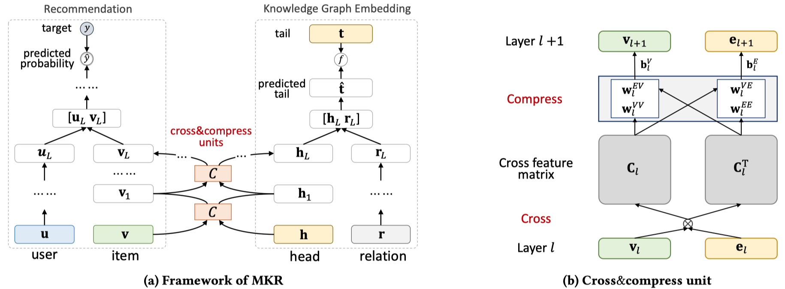
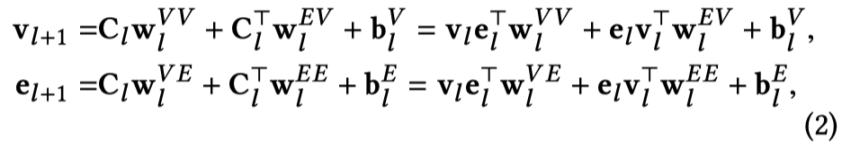

# Multi-Task Feature Learning for Knowledge Graph Enhanced Recommendation

WWW 2019

MKR将KG和RS看做两个不同的学习任务，提出了*cross&compress* unit。能够显式的捕获item和entities之间的高阶交互，并且自动在两个学习任务中控制cross knowledge。

<!--more-->

> Collaborative filtering often suffers from sparsity and cold start problems in real recommendation scenarios, therefore, researchers and engineers usually use side information to address the issues and improve the performance of recommender systems. In this paper, we consider knowledge graphs as the source of side information. We propose MKR, a Multi-task feature learning approach for Knowledge graph enhanced Recommendation. MKR is a deep end-to-end framework that utilizes knowledge graph embedding task to assist recommendation task. The two tasks are associated by cross&compress units, which automatically share latent features and learn high-order interactions between items in recommender systems and entities in the knowledge graph. We prove that cross&compress units have sufficient capability of polynomial approximation, and show that MKR is a generalized framework over several representative methods of recommender systems and multi-task learning. Through extensive experiments on real-world datasets, we demonstrate that MKR achieves substantial gains in movie, book, music, and news recommendation, over state-of-the-art baselines. MKR is also shown to be able to maintain a **decent** performance even if user-item interactions are sparse.

**motivation**：对于以前的很多基于KG的推荐方法，在处理KG的时候存在很多问题。比如PER和FMG，将KG作为一个异质信息网络，需要基于metapath进行推荐；对于RippleNet，没有办法很好的捕获KG中relation的重要性；对于CKE，利用了TransR进行训练，但是TransR更适合in-graph的任务而不是更适用于RS的任务。

**Method**：为了解决上面的问题，MKR，将基于KG的推荐问题看做多任务学习问题。multi-task learning (MTL)。在KG上的学习和在推荐上的学习任务不是完全独立的。在文献Learning Multiple Tasks with Multilinear Relationship Networks中提到了，一个item和它对应的entities，在RS和KG上可能具有相近的结构，并且可能在任务无关的特征空间中共享相似的特征。

> Therefore, an item and its corresponding entity are likely to have a similar proximity structure in RS and KG, and share similar features in low-level and non-task-specific latent feature spaces.

MKR提出了*cross&compress* unit。能够显式的捕获item和entities之间的高阶交互，并且自动在两个学习任务中控制cross knowledge。

来看一下模型结构。

总体而言，两个学习任务，两个学习任务之间的item和entities经过*cross&compress* unit进行学习，用户user和KG中的relation都是经过MLP进行学习。两个学习任务意味着两个loss。

在训练时，迭代一次，多次训练推荐任务，最后训练一次KG链路预测任务。

那么核心创新点就是*cross&compress* unit，看一下式子。

Cross部分：

对于item和entities进行tensor dot，不同维度之间相乘，捕获pairwise的interaction。

Compress部分：

将feature interaction matrix，投影到item和entities的不同feature space中：

**需要注意的点**：需要看到，它在投影时，即压缩时，在horizontal和vertical两个方向上同时进行投影。也就是说对于$C_L$和$C_l^T$同时投影。对于horizontal方向的压缩，不同行之间的区别在于$\mathbf{v}_l$，即item的信息；对于vertical方向的压缩，不同列之间的区别在于$\mathbf{e}_l$，即entities提供的信息。

