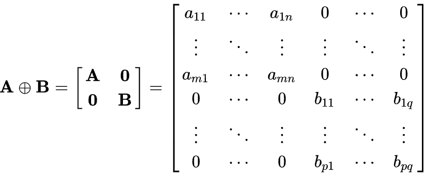
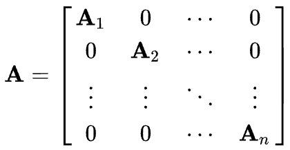

# Modeling Relational Data with Graph Convolutional Networks

2018

首个在KG上应用GNN的模型R-GCN

<!--more-->

## 1 Introduction

一个物品很多的信息隐藏在它的邻居内。R-GCN设计了一个encoder model，可以和其它的tensor factoraction model结合作为decoder。

R-GCN使用了DisMult作为decoder。

在FB15k-237，FB15k，WN18上面都进行了实验。

## 2 Neural Relational Modeling

### 2.1 Relational Graph Convolutional Networks

一般的GCN的形式可以定义为
$$
h_i^{l+1}=\sigma(\sum_{m \in M_i}g_m(h_i^{l}, h_j^{l}))
$$
$g_m$可以是neural network，也可以是简单的线性转换，$g_m(h_i, h_j)=Wh_j$

基于以上的原理，设计了如下的传播层：
$$
h_i^{l+1}=\sigma(\sum_{r\in R}\sum_{j\in N_i^r} \frac{1}{c_{i,r}} W_r^{l}h_j^{l} + W_o^l h_i^l )
$$
公式中的$c_{i,r}$可以为$|N_i^r|$，某个关系r的邻居的数量。

### 2.2 Regularization

这样设计导致了不同层的不同关系都有不同的weight matrix，在large scale knowledge graph下会导致快速增加的参数数量，导致过拟合。

为此，R-GCN使用了两种正则方式，都是针对$W_r^l$进行改进。

basis- and block-diagonal decomposition

**1、basis decomposition**：
$$
W_r^l=\sum_b^B a_{r,b}^l V_b^l
$$
$$
V_b^l \in R^{d^{(l+1)}\times (d^l)}
$$

这种情况下$W_r^l$成为线性组合同一层的不同关系，能够共享$V_b^l$，区别在于$a_{r,b}^l$。

> The basis function decomposition can be seen as a form of effective weight sharing between different relation types

这种方式可以看做是有$B$个矩阵$V$，然后与邻居实体embedding相乘，得到$B$个message embedding，然后对于不同的关系使用权重$a_{1,b}^l,\dots,a_{B,b}^l$去聚合。

**2、block-diagonal decomposition**
$$
W_r^l=\oplus_b^B Q_{b,r}^l
$$

$$
W_r = diag(Q_{1r}^{l},\cdots,Q_{Br}^{l})\ with\ Q_{br}^{l} \in \mathbb{R}^{(d^{l+1}/B)\times (d^{l}/B)}
$$

其中符号$\oplus$是矩阵加法中的Direct Sum，不是普通的相加，而是下面的形式，

这里说明下block-diagonal matrix，根据维基百科的解释

> A **block diagonal matrix** is a block matrix that is a [square matrix](https://en.wikipedia.org/wiki/Square_matrix) such that the main-diagonal blocks are square matrices and all off-diagonal blocks are zero matrices.

对于这种正则化方式的理解

> The block decomposition can be seen as a sparsity constraint on the weight matrices for each relation type.

它与bias decomposition的区别是它没有设置共享参数的结构，而是直接使用更加系数的$W_r$去拟合。

## 3 Entity Classification

对于实体分类，就是将entity 分类为K个class当中，那么在R-GNN的基础上，直接在最后一层的输出增加softmax就可以，训练时的loss为
$$
L=-\sum_{i\in Y}\sum_{k=1}^{K}t_{ik}lnh_{ik}^L
$$
$Y$是所有有label的entity集合。

## 4 Link Prediction

要进行Link Prediction，在R-GCN的基础上需要设计一个score function。

论文直接使用了DistMult作为decoder，
$$
f(s,r,o)=e_s^TRe_o
$$
训练的loss为
$$
L=-\frac{1}{(1+w)|\varepsilon|}\sum_{(s,r,o,y)\in \Gamma}{ylog(f(s,r,o)) + (1-y)log(1-f(s,r,o)) }
$$
前面的系数为归一系数，$w$为对于每一个postivite sample取$w$个negative samples，$|\varepsilon|$为所有实体的个数。

## 5 Empirical Evaluation

### 5.1 Entity Classification Experiments

数据集

- AIFB
- MUTAG,
- BGS
- AM

超参设计

- 2-layer model with 16 hidden units
- basis function decomposition
- Adam，learning rate of 0.01

Baseline：

- RDF2Vec embeddings 

- WeisfeilerLehman kernels (WL)  

- hand-designed feature extractors (Feat)

## 5.2 Link Prediction Experiments

| Dataset     | WN18    | FB15K   | FB15k-237 |
| ----------- | ------- | ------- | --------- |
| Entities    | 40,943  | 14,951  | 14,541    |
| Relations   | 18      | 1,345   | 237       |
| Train edges | 141,442 | 483,142 | 272,115   |
| Val. edges  | 5,000   | 50,000  | 17,535    |
| Test edges  | 5,000   | 59,071  | 20,466    |

FB15k-237是FB15K的reduced版本，去除了所有的inverse relation。

评估指标：

- MRR
- HIT@

