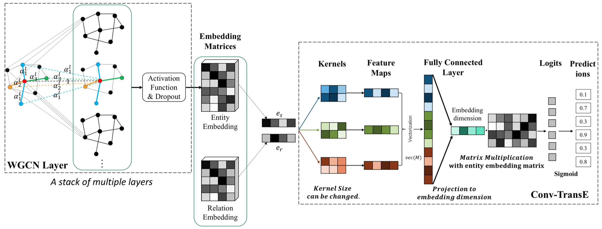
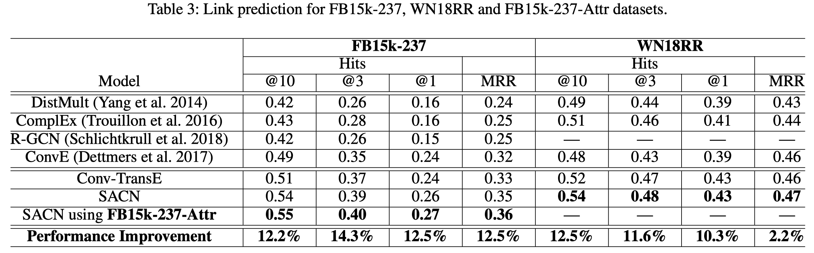

# End-to-End Structure-Aware Convolutional Networks for Knowledge Base Completion

AAAI 2019

W-GCN+Conv-TransE

W-GCN把不同的关系类型看做是不同的sub graph，不同的sub graph包括不同的weight。请注意这里的weight不同于一般的self-attention，W-GCN的weight是只与relation type有关的，而且不包括self-loop。

<!--more-->
$$
h_{i+1}=\sigma{\sum_{j\in N_{i}}\alpha_t^l h_j^l W^l + h_i^lW^l}
$$
Conv-TransE是在ConvE的基础上，取消了feature reshaing。直接将head entity embedding和relation embedding stack成$2\times d$的矩阵，之后使用$2\times k$的卷积核进行卷积操作，这样仍然能够保持TransE中的transformation property。

需要注意的是，它构建了一个新的数据集，FB15k-237-Attr，从FB24k中导出属性，增加到FB15k-237数据集中。

> We extract the attribute triples of entities in FB15k-237 from FB24k. During the mapping, there are 7,589 nodes from the original 14,541 entities which have the node attributes. Finally, we extract 78,334 attribute triples from FB24k. These triples include 203 attributes and 247 relations. Based on these triples, we create the “FB15k-237-Attr” dataset, which includes 14,541 entity nodes, 203 attribute nodes, 484 relation types. All the 78,334 attribute triples are combined with the training set of FB15k-237.

对于W-GCN如何处理attribute没有看懂。

实验结果

