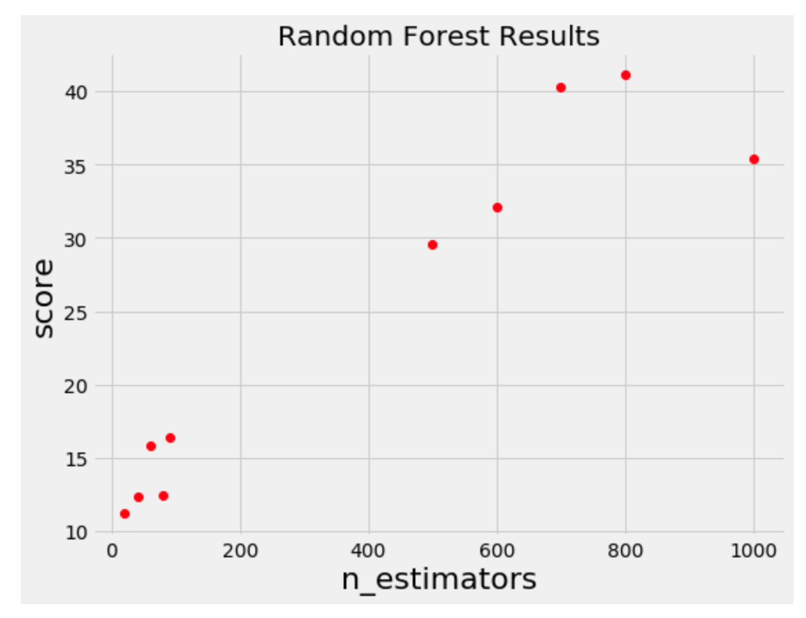
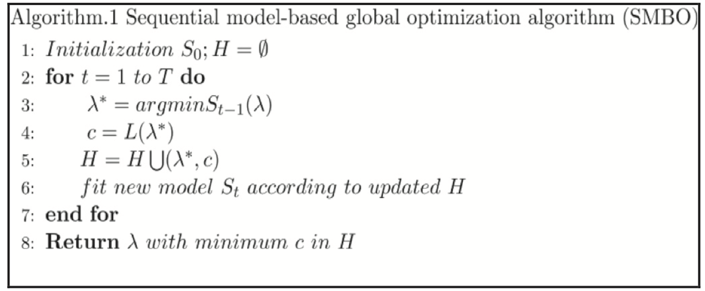
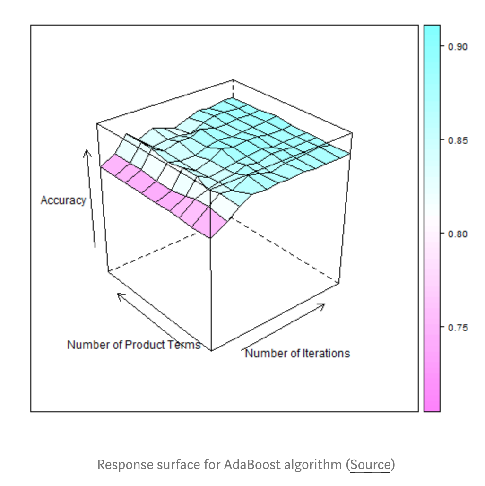
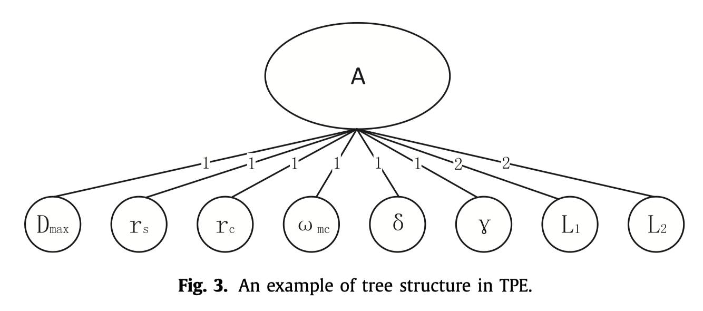
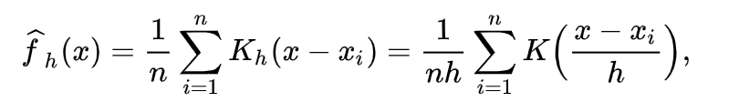
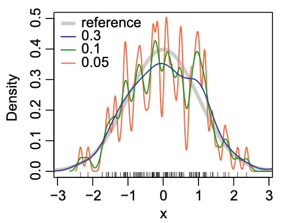
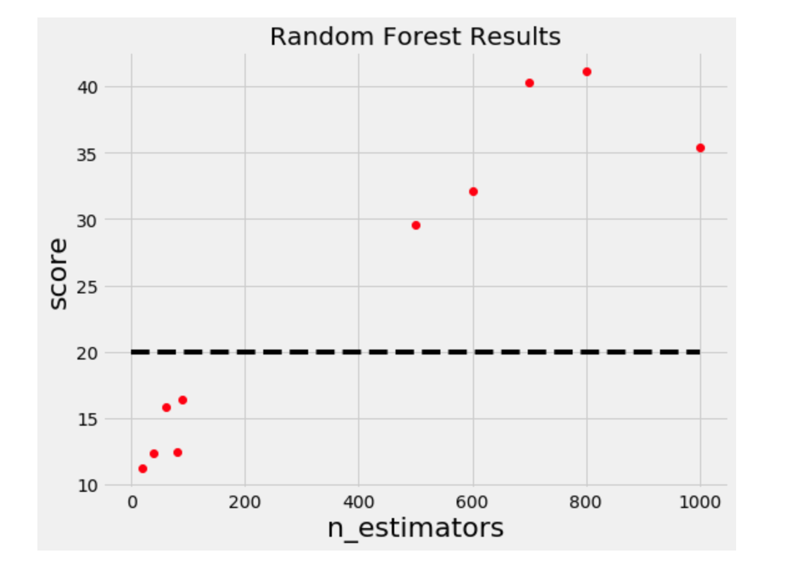
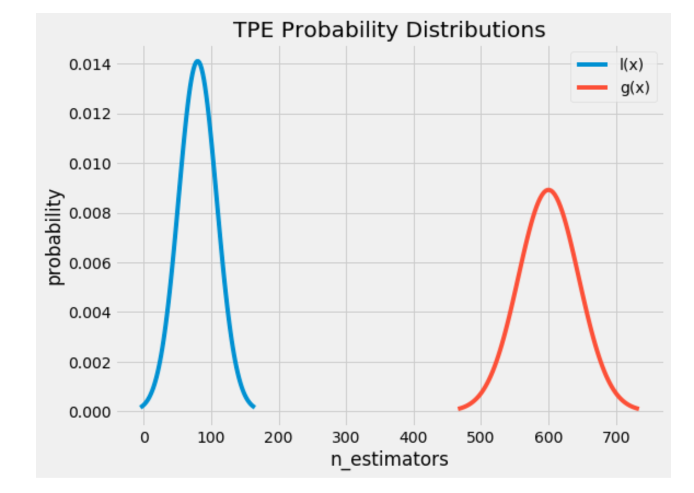

# The intuitions behind Tree-structured Parzen estimator

 TPE：一种基于贝叶斯推断的超参数调优方法。

<!--more-->

## Reference

[1] Frazier P I. A tutorial on bayesian optimization[J]. arXiv preprint arXiv:1807.02811, 2018.

[2] Bergstra J S, Bardenet R, Bengio Y, et al. Algorithms for hyper-parameter optimization[C]//Advances in neural information processing systems. 2011: 2546-2554.

[3] Xia Y, Liu C, Li Y Y, et al. A boosted decision tree approach using Bayesian hyper-parameter optimization for credit scoring[J]. Expert Systems with Applications, 2017, 78: 225-241.

[4] [A Conceptual Explanation of Bayesian Hyperparameter Optimization for Machine Learning](https://towardsdatascience.com/a-conceptual-explanation-of-bayesian-model-based-hyperparameter-optimization-for-machine-learning-b8172278050f)

## 1. Bayesian hyper-parameter optimization

贝叶斯超参数优化是一种为序列模式的模型提供的求全局优化的方法。

针对的问题：求解object function：

$$ min_{x\in A} f(x) $$

主要适用的情景：  

- x的维度不是太大，一般会限制在$d\lt20$，x可以理解为一个超参数序列
- $f(x)$是一个计算起来很消耗时间的函数，例如损失函数
- 对$f(x)$很难求导
- ......

举例：

纵坐标是$f(x)$，很明显如果是我们人工去选择下一组超参数的话，会在左下角score=20的这几个点中间去搜索，而不会还是进行一个全局的抽样。这实际就是一个贝叶斯优化过程。

但是对于Random search，grid search这些方法，并不会利用到历史的信息来进行选择。

## 2. Sequential model-based global optimization (SMBO)

### 2.1 伪代码

序列化模型全局优化(SMBO)是把贝叶斯优化的一个形式化的定义。具体的伪代码如下：

伪代码中出现的符号含义：

- $\lambda$：超参数
- $L$：object function，通常是损失函数

- $H$：记录了所有(超参数$\lambda$,  $L$)的历史集合

- $ S_{t} $：一个从超参数$\lambda \to L $的映射概率模型

循环一共进行T次：

1. 每次先根据已有的历史试验集合找出一个更可能拥有更小objective function的超参数集合$\lambda$
2. 之后计算实际的object function的值
3. 加入历史集合
4. 更新$S$

### 2.2 一些粗浅的理解

1. 不断的利用历史试验(trial)记录，构建出了一个下面的概率模型：

   $$ P(objective\ function\ score\quad |\quad hyperparameters) $$    

2. 叫做贝叶斯的原因是出现了先验概率的思想

3. 核心想法是**在更有可能得到更好结果的超参数范围内选择新的超参数**

### 2.4 核心要素

#### 2.4.1 Domain

不同的超参数有自己的取值范围，以及先验分布，例如均匀分布，log均匀分布等

#### 2.4.2 Objective Function

Objective Function是我们想要优化的目标。接受超参数作为输入，输出的值可以是超参数实例化后拟合了训练集的经验风险函数，如均方误差。

我们不会直接拿这个作为优化目标，而是使用下面的替代函数Surrogate Function。

#### 2.4.3 Surrogate Function

替代函数，也叫做响应面(response surface)，是基于之前的历史记录的一种关于objective function的概率表示。

叫做响应面是因为它是在高维层次的objective function score的关于超参数的概率。如下图：

存在几种不同的替代函数，如：

- Gaussian Processes
- Random Forest regression
- **Tree-structured Parzen Estimator**

#### 2.4.4 Selection Function

选择函数是如何根据前面的Surrogate Function，来选择新的超参数集合进行试验。

关于选择函数也有不同的表示，例如：

- **Expected Improvement (EI)**
- Probability of Improvement

## 3 Tree-structured Parzen estimator(TPE)

### 3.1 基础认识

1. Tree：超参数优化问题可以理解为在图结构的参数空间上不断寻找objective function最优解的问题。所谓tree，是提出TPE的作者将该优化问题限制在了树状结构上，例如：

   

   一些超参数只有在其它的超参数确定后才能够进行确认，例如网络的层数与每一层的节点数量，当然这不意味着这两个超参数是相关的。**实际上在TPE中，要求所估计的超参数必须是相互独立的**。

2. Parzen：[Parzen–Rosenblatt window](https://en.wikipedia.org/wiki/Kernel_density_estimation)是在核密度估计问题中，由 [Emanuel Parzen](https://en.wikipedia.org/wiki/Emanuel_Parzen) 和 [Murray Rosenblatt](https://en.wikipedia.org/wiki/Murray_Rosenblatt)提出的能够根据当前的观察值和先验分布类型，估计估计值的概率密度。一般的函数如下：

   

   

   **在TPE中，假设了核函数都是高斯核函数**

### 3.2 具体过程推演

#### 3.2.1 Expected Improvement (EI)

对于选择一组新的超参数后的objective function的提升可以表示为：

$$ I(\lambda) = max(c^{*}-c(\lambda), 0) \tag{1}$$ 			

$c^{*}$是当前记录的H中所有c的一个分割点，我们这里直接认为c表示的就是风险函数。

通过这样的转换，我们就把原来的objective function最优问题转换成了一个新的问题。

如果新的$\lambda$对应的$c(\lambda)$更小，则它是更好的超参数设置，但是这需要训练，然后求出风险函数，并不是我们想要的。

那么如果一个新的$\lambda$对应的提升的期望是大于0的，那么可认为这个$\lambda$是有较大可能使得风险减小的。故有：

$$ \begin{split}EI(\lambda) &= \int\limits_{-\infty}^{c^{*}}(c^{*}-c)P_{S_{t-1}}(c|\lambda)dc \\ &= \int\limits_{-\infty}^{c^{*}}(c^{*}-c)\frac{p(\lambda|c)p(c)}{p(\lambda)}dc \end{split} \tag{2} $$ 			

式子中的$p(\lambda|c)$定义为：

$$ p(\lambda|c) = \left\{ \begin{aligned} &l(\lambda) \quad c \lt c^{*} \\ &g(\lambda) \quad c \ge c^{*} \end{aligned} \right. \tag{3} $$

$c^{*}$是一个阈值，通常是在H所有的c中，满足$p(c<c^{*})=\gamma$，$\gamma$默认可设置为0.15。这样所有的历史记录就分成了两部分，即风险较小的那部分和风险相对较大的那部分，$l(\lambda)$是由所有的风险较小的那部分的超参数集合形成的分布，$g(\lambda)$是由所有的风险较大的那部分的超参数集合形成的分布。如下图：

直觉上我们从风险较小的分布中抽样新的超参数，应该是比较合理的，下面的数学推理也证明了这一点。

继续推导公式2：

$$\begin{split} p(\lambda) &= \int_{R}p(\lambda|c)p(c)dc \\ &= \int_{-\infty}^{c^{*}}p(\lambda|c)p(c)dc + \int_{c^{*}}^{+\infty}p(\lambda|c)p(c)dc \\ &= \gamma l(\lambda)+(1-\gamma) g(\lambda) \end{split}$$

$$\begin{split} \int_{-\infty}^{c*} (c^{*}-c)p(\lambda|c)p(c)dc &= l(\lambda)\int_{-\infty}^{c*}(c^{*}-c)p(\lambda|c)p(c)dc \\ &=\gamma c^{*}l(\lambda) -l(\lambda) \int_{-\infty}^{c*} cp(c)dc \end{split}$$

最终得到：

$$\begin{split} EI(\lambda) &= \frac{\gamma c^{*}l(\lambda) -l(\lambda) \int_{-\infty}^{c*} cp(c)dc}{\gamma l(\lambda)+(1-\gamma) g(\lambda)} \\ & \propto \big( \gamma+\frac{g(\lambda)}{l(\lambda)}(1-\gamma) \big)^{-1} \end{split}$$

这说明在$l(\lambda)$的分布下取样得到的参数更有可能让$EI(\lambda)$有更大的值。

#### 3.2.2 估计超参数的分布

由 $c^{*}$将历史记录分为了两部分，以 $ c \lt c^{*} $  的那部分超参数集合为例。

假设存在n个取值 $ (x_1,x_2, \dots, x_n) $ ，那么概率密度的估计是

$$ \hat{p}(x) = \frac{1}{nh}\sum\limits_{i=1}^{n}K\big( \frac{x-x_i}{h} \big) $$

其中

$$ K\big( \frac{x-x_i}{h} \big) = \frac{1}{\sqrt{2\pi}} exp\big( -\frac{1}{2}(\frac{x-x_i}{h})^2 \big) $$

#### 3.2.3 求解的过程

利用TPE，首先对于所有的超参数形成的那棵树进行设置，因为TPE要求所有的超参数要相互独立，即一种正交的概念，即效果不能相互影响，例如学习率，提升树方法的迭代次数，和树的最大深度就存在一个权衡，所以需要先固定一些不能一起用于优化的超参数，如固定学习率和迭代次数。

由树从根结点从上而下的利用Parzen estimator，对某一个节点，在 $l(\lambda)$分布下采样，比如采样100次。

每一次的采样得到的超参数集合可以分别得到它们的概率，然后相乘得到联合概率，算出 $ l(\lambda)$和 $g(\lambda)$。选取其中 $l(\lambda)/g(\lambda)$ 的最大值，作为这一次迭代选取的超参数。