# Knowledge Embedding Based Graph Convolutional Network

WWW 2021, [KE-GCN](https://github.com/PlusRoss/KE-GCN)，提出了一个泛化的框架，将GCN和KGE的传统方法结合起来，认为在GCN中的信息传播过程是传播计算edge是否存在的得分函数$f(u,r,v)$对$v$的梯度，并且提出了对于relation的传播过程，在knowledge graph alignment和entity classification上进行了实验。

<!--more-->

> Recently, a considerable literature has grown up around the theme of Graph Convolutional Network (GCN). How to effectively leverage the rich structural information in complex graphs, such as knowledge graphs with heterogeneous types of entities and relations, is a primary open challenge in the field. Most GCN methods are either restricted to graphs with a homogeneous type of edges (e.g., citation links only), or focusing on representation learning for nodes only instead of jointly propagating and updating the embeddings of both nodes and edges for target-driven objectives. This paper addresses these limitations by proposing a novel framework, namely the Knowledge Embedding based Graph Convolutional Network (KE-GCN), which combines the power of GCNs in graphbased belief propagation and the strengths of advanced knowledge embedding (a.k.a. knowledge graph embedding) methods, and goes beyond. Our theoretical analysis shows that KE-GCN offers an elegant unification of several well-known GCN methods as specific cases, with a new perspective of graph convolution. Experimental results on benchmark datasets show the advantageous performance of KE-GCN over strong baseline methods in the tasks of knowledge graph alignment and entity classification .

## 1 Introduction

**motivation**：

- 传统的GCN方法主要假设在同质图上进行学习，忽略了KG中的relation蕴含的丰富的信息。
- 传统的KGE方法没有考虑graph的结构信息
- 将GCN和KGE结合的方法比如VR-GCN，COMPGCN等，在学习relation embedding的时候没有考虑entity embedding对relation embedding的影响

**method**：

为了解决上面的问题，提出了KE-GCN（Knowledge Embedding based Graph Convolution Network），能够结合KGE的方法，基于图卷积操作同时学习entity和relation embedding。

## 2 Method

### 2.1 Reformulation of Vanilla GCN

作者首先从新的角度看原始GCN的公式：

原来GCN的公式：

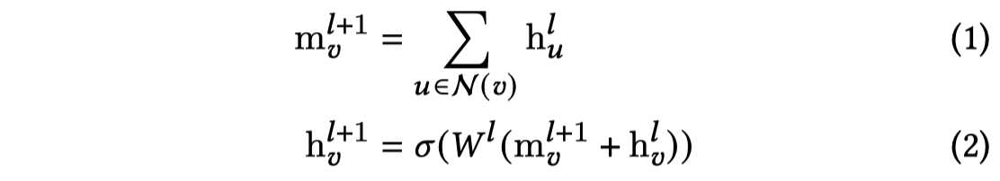

通过引入一个得分函数，重新定义GCN，假设引入得分函数$f$，该得分函数计算edge存在的score，对于已经存在的edge输出较大的值；对于不存在的边输出较小的值。假设$f$为求内积：
$$
f(h_u,h_v)=h_u^T h_v
$$
那么计算的消息$h_u$能够看做是$f$对$v$的梯度，那么所有的$h_u$加起来就成为下面的形式

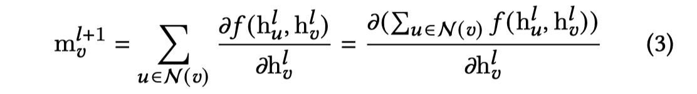

此时对于$h_v+m_v$看做是learning rate为1，对$h_v$的梯度提升；目的是使scoring function$f$的值最大。

通过修改为上面的形式，能够看到，它从新的角度说明了GCN做了什么，邻居信息是如何提供给中心节点的，是如何帮助中心节点获得更好的表示的。

> The above reformulation provides an explicit view about what the vanilla GCN is optimizing, instead of how the updates are executed procedurally.

### 2.2 The New Framework

新的framework有两个核心部分，更新实体表示以及更新关系表示：

更新实体表示：

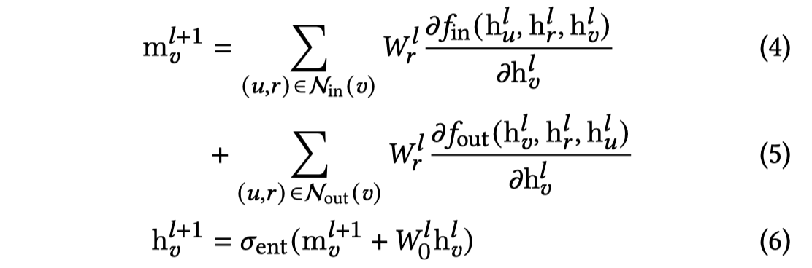

更新关系表示：

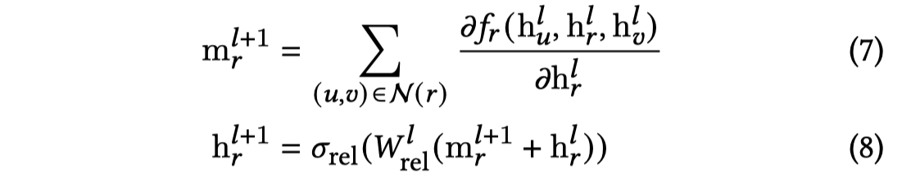

更新的关系表示实际提供了一种global的view。

整体结构：

消息传递过程：

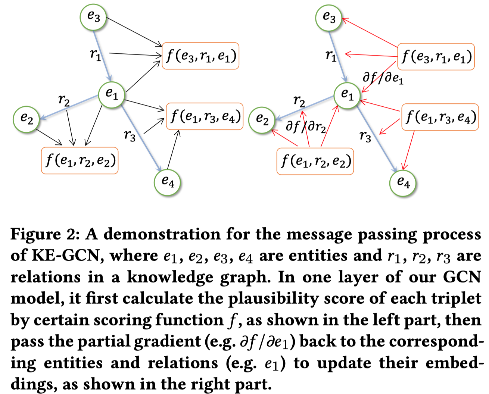

消息聚合过程：

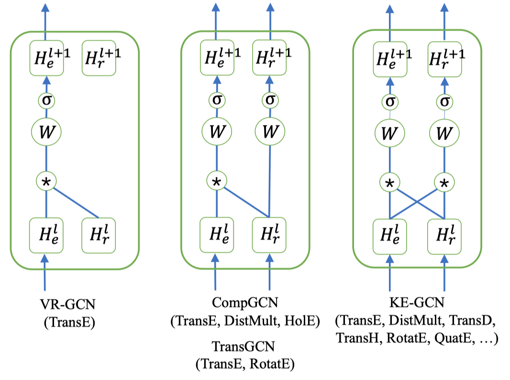

它能够泛化COMPGCN、R-GCN以及W-GCN。实际上COMPGCN本身就已经泛化了R-GCN和W-GCN，这部分泛化参考论文原文。

## 3 EXPERIMENTS

在实验的时候，对于KE-GCN，主要是引入不同的得分函数$f$，该得分函数使用不同的KGE方法，并且为了简化模型，对于in，out，self-loop都使用了相同的$W$和相同的得分函数$f$。

使用了一系列的KGE方法：

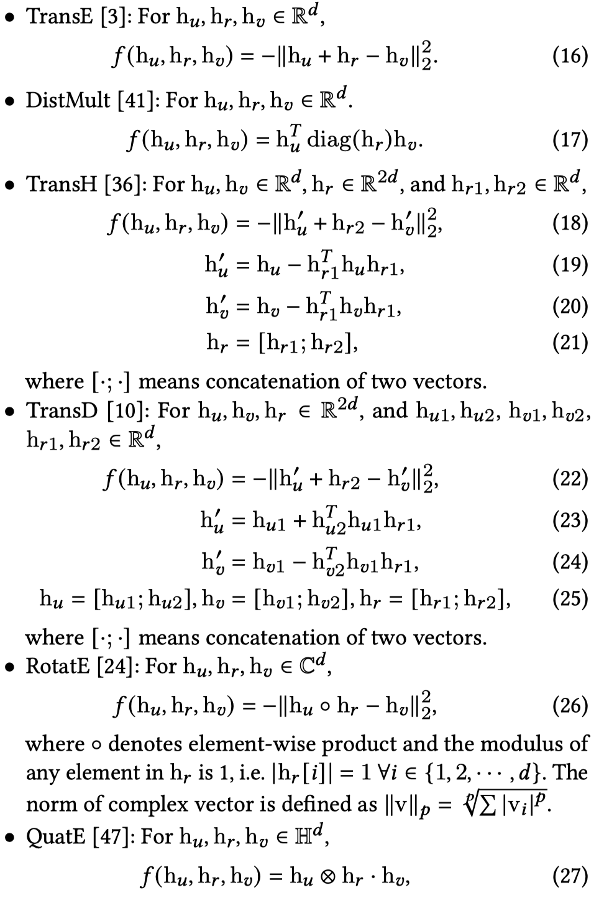

### 3.1 Knowledge Graph Alignment

匹配不同KG中的实体和关系，在实验中直接计算embedding之间的L1-distance，

在这种情况下的loss function

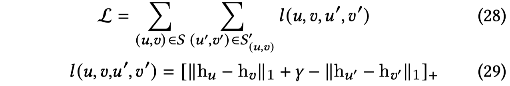

数据集，

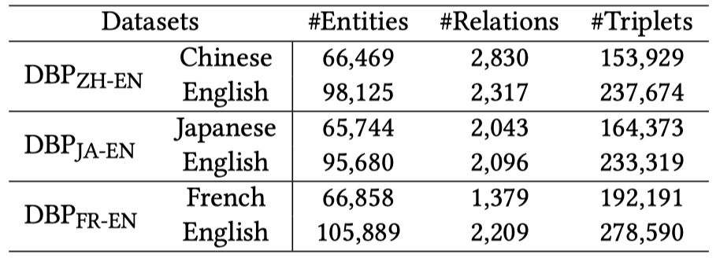

结果，这里只贴了KE-GCN的比较：

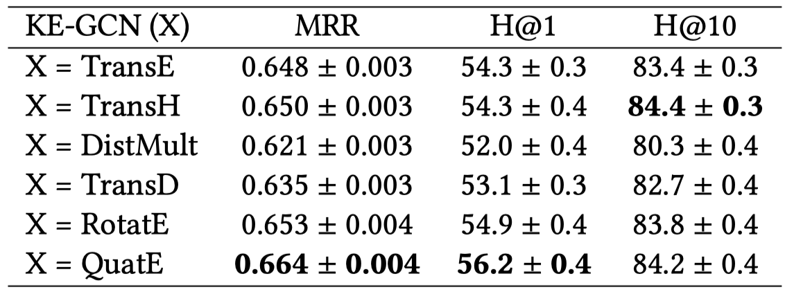

### 3.2 Knowledge Graph Entity Classification

在这种情况下的loss function

multi-class classification

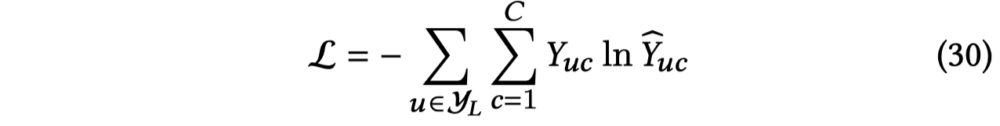

multi-label classification

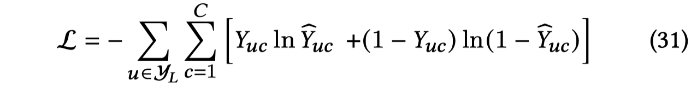

数据集，AM和WN是multi-class，FB15K是multi-label

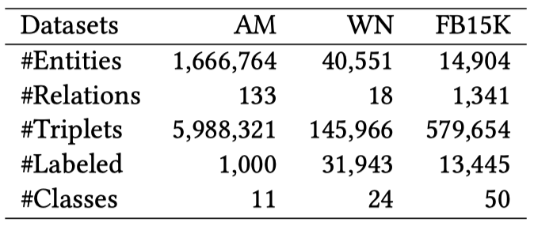

结果：

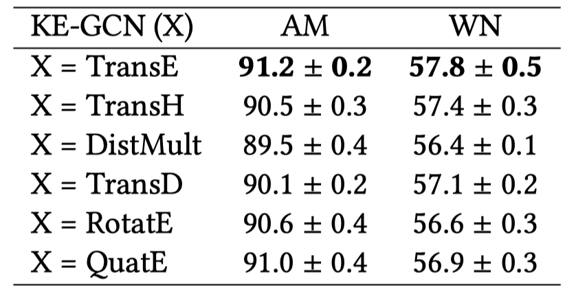


