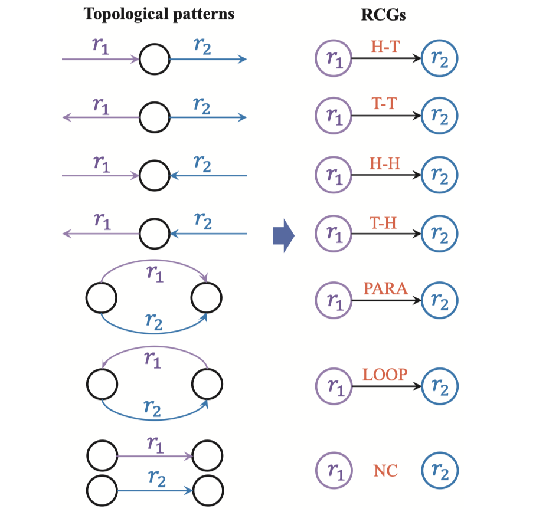
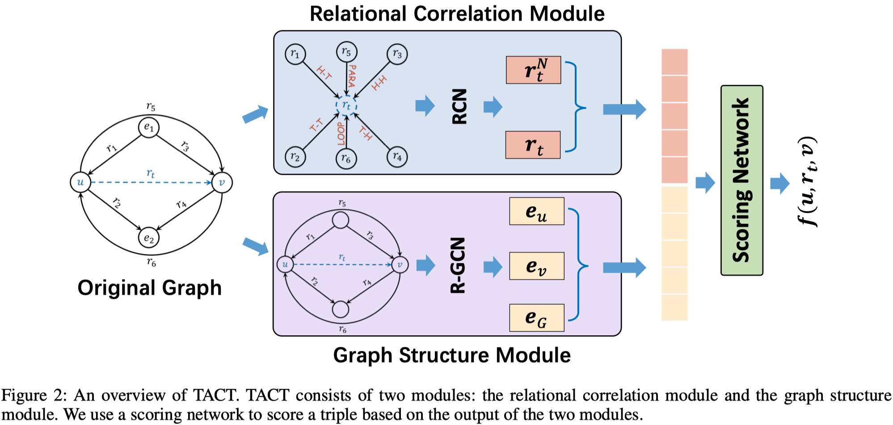
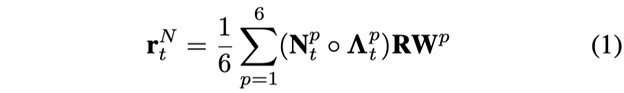
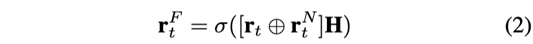

# Topology-Aware Correlations Between Relations for Inductive Link Prediction in Knowledge Graphs

AAAI 2021

[TACT](https://github.com/MIRALab-USTC/KG-TACT)，作者主要考虑的是inductive link prediction，使用gnn，捕获relation之间的语义上的关联性，即semantic correlation。作者认为relation之间的关联性通过relation的拓扑结构得到体现，因此，作者将所有的relation之间相连的拓扑结构分为7种，在relation形成的graph中进行学习，提出了RCN。

<!--more-->

> Inductive link prediction—where entities during training and inference stages can be different—has been shown to be promising for completing continuously evolving knowledge graphs. Existing models of inductive reasoning mainly focus on predicting missing links by learning logical rules. However, many existing approaches do not take into account semantic correlations between relations, which are commonly seen in real-world knowledge graphs. To address this challenge, we propose a novel inductive reasoning approach, namely TACT, which can effectively exploit Topology-Aware CorrelaTions between relations in an entity-independent manner. TACT is inspired by the observation that the semantic correlation between two relations is highly correlated to their topological structure in knowledge graphs. Specifically, we categorize all relation pairs into several topological patterns, and then propose a Relational Correlation Network (RCN) to learn the importance of the different patterns for inductive link prediction. Experiments demonstrate that TACT can effectively model semantic correlations between relations, and significantly outperforms existing state-of-the-art methods on benchmark datasets for the inductive link prediction task.

## 1 Introduction

作者考虑的是比较另类的link prediction，inductive link prediction。即在测试集中要预测的实体没有在训练集中出现。像是最常见的link prediction都是transductive link prediction，不能保证对新出现的实体也有比较好的预测效果。

为了进行inductive learning，就必须保证能够将训练集中训练好的信息能够迁移到测试集上。具体到link prediction上，就是说需要方法能够进行entity-independent的学习。因为relation应该是已有的，不是新出现的。

之前的inductive link prediction很多事基于rule的学习，因为学习到规则的话，这种规则是entity-independent的。

作者考虑在relation上做文章，主要考虑利用topology pattern捕获relation之间的semantic correlation。

## 2 Methods

首先把KG上所有的relation的关联关系分为7种，作者在附录中证明了一共只有7种。

然后看一下整体结构：

两个模块，RCN+R-GCN

RCN是核心创新点，构造了一个只由relation组成的graph，relation之间的edge有6种（NC的这种不存在）。

RCN学习了$\mathbf{r}_t$，R-GCN学习$\mathbf{e}_u$，$\mathbf{e}_v$，以及graph embedding$\mathbf{e}_G$。

主要看下RCN，两步：

其中的$N_t^P\in \mathbb{R}^{1\times |R|}$，取值为0/1，表示关系之间的相连性；$\Lambda_t^P\in \mathbb{R}^{1\times |R|}$，是可学习的参数，表示relation之间的correlation coefficients，并且保证 $\sum_{i=1}^{|R|}\Lambda_t^P=1$。

然后得到relation $t$最终表示：

