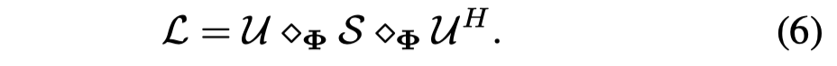
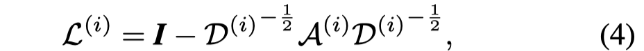
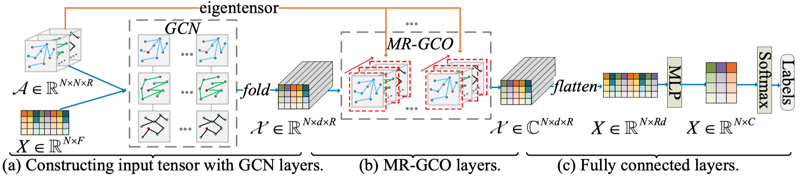

# MR-GCN: Multi-Relational Graph Convolutional Networks based on Generalized Tensor Product

IJCAI 2020

2020-7

作者在定义了在multi-relational graph中的卷积操作，命名为MR-GCO（multirelational graph convolution operators），提出了一个可以用来做node classification的网络MR-GCN。

<!--more-->

**motivation**：现在的几个解决multi relation的GCN模型，倾向于在不同relation的graph中执行GCN卷积操作，然后混合（blending）结果。作者认为这种做法忽略了relation之间的correlation。

现有的处理multi-relational graph的方法主要有两种思路：

1. 每个relation graph下进行GCN，然后融合，比如R-GCN，mGCN，Megan等，在这种情况下relation之间的correlation无法被显式的捕获。

> The first line conducts GCN on each single relation and then integrates the results with multi-view learning.

2. 另一种思路是把multi-relational graph转换为一个同质图homogeneous graph。比如Multi-GCN等。这一类方法存在的问题是可能存在信息的损失等。

> Another line is aggregating the multi-relational graph into a homogeneous graph.

**methods**：作者在定义了在multi-relational graph中的卷积操作，命名为MR-GCO（multirelational graph convolution operators），提出了一个可以用来做node classification的网络MR-GCN。

**contribution**：

- 首个通过tensor eigen-decomposition，从GCNs spectral graph theory发展到multi-relational graphs下的convolution operator。
- MR-GCN是通过定义generalized tensor product的tensor eigen-decomposition进行的，因此除了可以基于快速傅里叶变换进行外，还可以融合Haar, Discrete Cosine transform (DCT)等。

MR-GCO是作者论文的核心，主要思想从推导过程来看和一般情况下的图卷积是一致的。

由于对泛化的张量积的核心思想不了解，因此无法确切的理解作者的操作。

MR-GCO的定义，对于图信号 $x\in \mathbb{R}^{N\times R}$和过滤器$g\in \mathbb{R}^{N\times R}$，作者定义为：

其中$U$是对于多关系拉普拉斯矩阵进行张量特征分解后的结果：

其中的特殊运算 $\diamondsuit_\Phi$就是泛化的张量积$\Phi$-product，$\Phi$是转化矩阵。

其中的拉普拉斯矩阵是多关系的三阶张量，每个relation有一个不同的拉普拉斯矩阵

直接看作者结果

