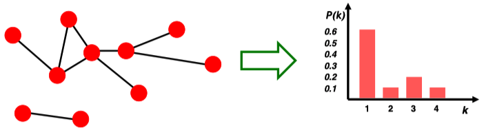
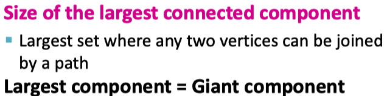
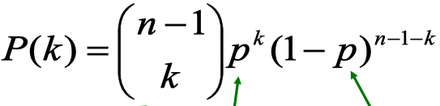
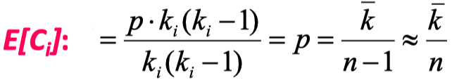
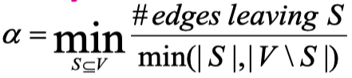
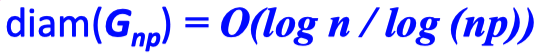
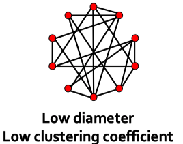
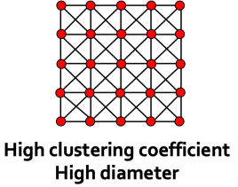
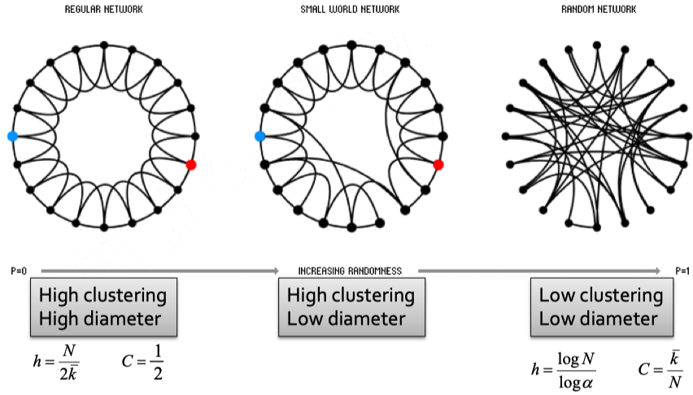

# Properities of networks, Random Graph Model

在下面所提到的图默认是无向图。介绍了graph的四种属性

<!--more-->

## Network Properties

4 key network properties

1. Degree distribution $P(k)$

具有不同度的节点数量在所有graph node中的比例

2. Paths in a graph

在图中的路径path是指节点的序列。在有向图中的path需要遵循edge的direction。

有了path就可以衡量距离distance，两个节点的distance是最短路径shortest path。

定义了distance之后，可以定义graph的直径diameter。graph的diameter是所有节点对的distance中最长的值。

3. Clustering coefficient

聚类系数clustering coefficient衡量了节点的邻居之间的连接性。clustering coefficient针对的是graph中的每一个node。具体算法是计算邻居之间的边/理想中最多的领居间边的数量。
$$
C_i= \frac{2e_i}{k_i(k_i-1)}
$$
其中，$e_i$是邻居间的边的数量，$k_i$是节点$i$的度。$k_i(k_i-1)$计算了所有邻居节点之间都存在一个边的上限情况。聚类系数在0-1区间。

4. Connectivity

定义为最大连通单元中节点的数量。

## Random Graph Model

我们可以设定一些条件，产生人造的随机graph，来促进我们对于现实graph的理解。

可以有两种random graph

1. $G_{np}$：n个node，node之间产生edge的概率是$p$。
2. $G_{nm}$：n个节点，随机产生$m$个边。

研究这两种random graph的properties。

对于$G_{np}$：

### Degree Distribution

### Clustering Coefficient

### Path Length

首先定义Expansion，核心思想是随机选一个node集合，有多少的边会离开这个集合。

式子定义：

式子下面的分母表示对于一个划分来说，如果划分的S越大，节点越多，如果离开集合S的edge数量不变，那么expansion应该小；如果划分的集合S的node数量不变，那么离开S的edge数量越多，expansion越大。随机的划分S，能得到V-S，对于S和V-S都可以计算出一个expansion，离开这两个集合的edge数量一样，但是如果拿较大的集合来算的话，计算出来的expansion就会偏小。因此，总是以数量较少的集合作为考虑的点。

随机的划分集合，能得到很多的expansion，为了衡量整个graph的expansion，考虑expansion的下限，即最小的那个expansion。在这种情况下，如果graph的expansion比其它graph的expansion更大，可以理解为这个graph的expansion更大，locality更弱。

一个random graph的path length是$O(log\ n)$。diameter是:

也就是说对于random graph来说，随着node数量增加，diameter并不会增加很多。

### Lagest Connected Components

在random graph中，随着平均degree增加，node链接到giant component的概率增加。

## The Smallest-World Model

仔细观察下network的properties会发现，聚类系数与graph的直径似乎是两个有点冲突的属性。如果聚类系数比较高，说明一个graph的locality强，那么node与较远的node之间就比较难有直接的链接，这会造成graph的路径很大。

一个graph的diameter衡量了graph的“shortcut”，如果diameter比较小，意味着对于一个node，可以在较小的step内链接到其它node。但是直径变小的话，一个graph的locality似乎会被破坏，一个node的很多邻居之间不相连，而是有更多的edge链接到其它的node上。

那么，是否有办法让graph同时具有high clustering和small diameter？

解决方案是the smallest-world model。1998。

核心是对于一个已经具有high clustering的graph，引入randomness，新增/删减edge来创建更多的“shortcut”。

示例图：

